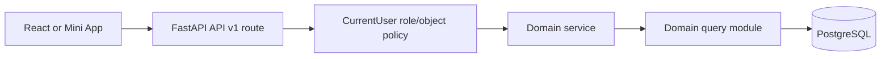

# API Migration Status

Date: 2026-07-10

Branch documented: `FastAPI-Run-System`

## Current Result

The JSON/action API is versioned under `/api/v1`. There are no runtime routes in the deleted legacy namespaces:

- `/admin/api/*`
- `/teacher/api/*`
- `/student/api/*`
- `/academic-director/api/*`
- `/head-of-department/api/*`
- bare non-versioned `/api/*`

`tests/route_snapshot.txt` is the executable route inventory. Avoid copying a route count into architecture decisions because generated documentation routes and ongoing slices can change the total.

## Versioned API Ownership

| Namespace | Current responsibility |
| --- | --- |
| `/api/v1/auth/*` | current account and self-service password lifecycle |
| `/api/v1/system/*` | status/health-facing system information |
| `/api/v1/academic-director/*` | academic structure, gradebook, HOD, and Teacher Academy actions |
| `/api/v1/head-of-department/*` | subject-scoped Teacher Academy actions |
| `/api/v1/admin/*` | system/admin operational slices during workspace separation |
| `/api/v1/teacher/*` | teacher office-hour availability and bookings |
| `/api/v1/student/*` | activity, chat, resource comments, and office hours |

API v1 routes use FastAPI schemas/dependencies, call domain services, and return the shared API success/error envelope. Object authorization belongs in dependencies/domain policy, not in frontend visibility rules.

## Page and Public Routes

These are intentionally outside the JSON API:

- role pages such as `/student`, `/teacher`, `/parent`, `/academic-director`, `/head-of-department`, `/ceo`, `/hr`, and `/support`;
- student dashboard compatibility pages under `/dashboard/{public_enrollment_id}`;
- `/account/security`;
- credential login/logout and `/auth/telegram`;
- hashed parent invite pages at `GET|POST /parent/invite/{code}`;
- remaining admin HTML form actions under `/admin/*`.

The existence of an `/admin/*` form action does not make it a second JSON API. New JSON mutations must use `/api/v1/*`.

## Completed Migration Work

### Routes and pages

- Central `backend/api/v1/router.py` registration is installed before page routers.
- Academic Director and HOD Teacher Academy JSON mutations use v1 routes, shared schemas, response adapters, and explicit HOD subject-scope policy.
- Admin announcements, complaints, chat, resources, payments, parents, students, office hours, and academic slices use v1 endpoints where migrated.
- Student chat, comments, activity, and office hours use `/api/v1/student/*`.
- Teacher office hours use `/api/v1/teacher/*`.
- Student, parent, teacher, Academic Director, HOD, CEO, HR, and support page shells live under `backend/pages`.
- The old signed `/parent/link/{token}` routes are deleted; only `/parent/invite/{code}` remains.

### Domain ownership

- SQL moved out of the former `database/queries` and `database/cross_queries` barrels into domain query modules.
- Runtime schema/table bootstrap was removed; DDL is Alembic-only.
- Canonical password and Telegram auth moved to `backend/domains/identity`.
- Parent linking moved into one parent-domain transaction used by web and Telegram-start flows.
- Payment, office-hours, chat, academic group movement, and student dashboard flows resolve canonical identity and enforce object boundaries in the backend.

### Deleted compatibility surfaces

- `database/queries/*`
- `database/cross_queries/*`
- `database/tables.py`
- legacy account/password and Telegram identity facades under `backend/identity`
- parent service/invite facades superseded by `backend/domains/parents`
- legacy Telegram bot helper/handler code

## Current Request Flow



For pages, the route authenticates and builds a bootstrap payload; subsequent mutations still follow the API v1 flow.

## Canonical Student Boundary

`CurrentUser.student_db_id` is `msi_v2.students.id`. It is the identity used for student-scoped API authorization and relational writes.

Some older admin/parent route parameters retain the name `student_row_id`, and student dashboard URLs use a public enrollment/dashboard ID. These compatibility values must be resolved to the canonical student before authorization or mutation. New APIs should not copy the ambiguity.

## Remaining Transitional Work

- The system/admin workspace still has HTML form actions under `/admin/*` and helper code under `backend/roles/admin`.
- A few page/workspace helper services remain under `backend/roles`; they should move only with equivalent behavior and tests.
- Some external payload fields and route parameter names expose legacy IDs for compatibility.
- Physical schema name `msi_v2` and legacy correlation columns remain intentionally.
- Empty placeholder API directories can be removed or populated only as real role functionality is implemented.

These are explicit compatibility boundaries. They do not justify reintroducing old API namespaces or database query barrels.

## Verification

```bash
python3 -m pytest tests/test_route_snapshot.py tests/test_api_v1_architecture.py
python3 -m pytest tests/test_architecture_cleanup.py tests/test_phase1d_structure_safety.py
python3 -m compileall -q backend database tgbot scripts main.py
npm --prefix frontend run check-types
npm --prefix frontend run build
git diff --check
```

Run the full backend suite before release. Production `main` remains read-only until an explicitly approved release/merge process.
