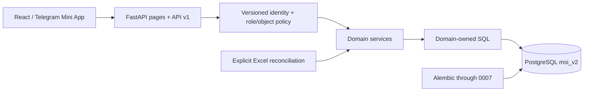

# LMS Architecture Cleanup Report

Date: 2026-07-10

Branch: `FastAPI-Run-System`

Production `main`: inspected as a read-only reference; not changed

## Outcome

The rewrite now has one canonical identity authority, domain-owned persistence, Alembic-only DDL, versioned API/action routes, explicit import/reconciliation boundaries, and a shared responsive React UI architecture. The former Google-Sheets/Telegram-mini-app architecture is no longer the system core.

## Improved

### Identity and access

- `msi_v2.accounts` is the only password-hash authority.
- Student, teacher, parent, and staff profiles connect accounts to business entities.
- New login-equals-password credentials force a private password before workspace use.
- All password-enabled roles share `/account/security` and `PATCH /api/v1/auth/password`.
- Password changes/resets are audited and increment `session_version`.
- Middleware invalidates cookies after account version, role, or status changes.
- Telegram authentication resolves the same canonical account/profile.
- Parent invite claims are hash-backed, expiring, single-use, row-locked, and atomic.

### Persistence and architecture

- Runtime SQL moved to matching domain query modules.
- Runtime DDL helpers were removed; the migration chain now reaches `0007_lms_integrity`.
- Canonical `students.id` is used for backend authorization and relational writes.
- Payment, office-hour, chat, parent, and academic group operations enforce object boundaries server-side.
- Integrity constraints cover invite state, credentials, office hours, legacy enrollment IDs, attendance/homework references, score scales, and coin events.
- Student coins are treated as one student-wide ledger; group is optional event provenance.
- Program progress uses actual program totals rather than an invented global lesson count.

### API and frontend

- JSON/action endpoints use `/api/v1/*`; old role API namespaces are gone.
- Page shells are separated from API mutations.
- React uses a server bootstrap page registry and shared route helpers.
- Shared UI primitives improve focus/keyboard behavior, touch targets, responsive navigation, cards/tables, chart containers, safe areas, and reduced motion.
- Date/week and office-hour helpers use `Asia/Tashkent` consistently.
- Valid zero metrics are preserved, and missing lesson times are not fabricated.

## Removed

- `database/queries/*`, `database/cross_queries/*`, and `database/tables.py`;
- runtime table/index bootstrap calls;
- legacy password-auth and Telegram-auth identity facades;
- parent account/invite compatibility facades and the old signed-token route;
- retired Telegram handler/helper modules;
- stale live Google Sheets runtime assumptions and non-versioned role API namespaces.

## Deliberately Retained

- physical schema name `msi_v2`;
- legacy row/enrollment/public-dashboard fields needed at explicit compatibility boundaries;
- remaining `/admin/*` HTML form routes and role workspace helpers;
- Telegram Mini App authentication and parent linking;
- Teacher Academy outbound Telegram notifications;
- an empty `tgbot` router registry for future product-approved handlers;
- explicit Excel curriculum/reconciliation tools.

## Data Reconciliation Statement

This report does not claim that School 5 or Sehriyo workbook rows exactly match PostgreSQL. Parsing counts, aggregate totals, and a successful dry run are not enough to prove parity. Exact status must come from the final reconciliation report after ambiguous identities, source dates/orders, scores, exams, and coin balances are resolved without invented values.

## New Architecture

## Release Gate

Before any production merge/deploy:

1. upgrade a disposable representative database clone to Alembic head;
2. run the full backend suite and architecture/route tests;
3. run frontend logic tests, typecheck, build, and browser accessibility/responsive checks;
4. complete and review the workbook reconciliation report;
5. confirm no secrets, workbooks, dumps, or generated caches are staged;
6. use an explicitly approved process to merge from the rewrite branch to production `main`.
