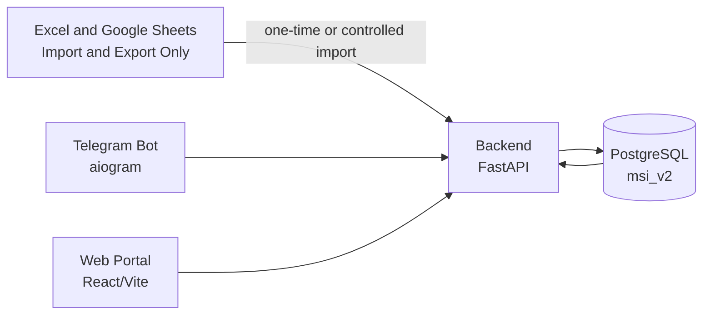
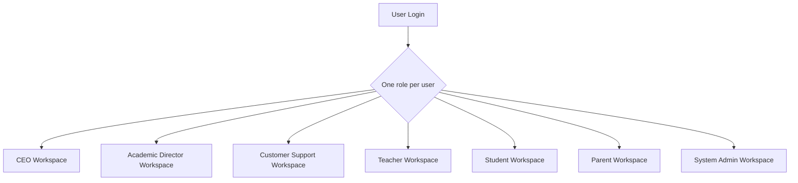

# CEO Overview

Audience: CEO and business leadership.

Project: MSI LMS Portal.

Status: planning and rebuild documentation. This document separates what exists today from what we plan to build.

## Executive Summary

MSI LMS Portal is the planned central platform for managing MSI's IGCSE learning operations across multiple schools.

It will bring students, teachers, parents, academic leadership, customer support, payments, and company reporting into one PostgreSQL-first platform.

The current system already has a FastAPI backend, React/Vite frontend, aiogram Telegram bot, and PostgreSQL database. Academic Excel statistics for School 5 and Sehriyo have been migrated and verified in PostgreSQL.

The next stage is not just adding screens. It is rebuilding the system around clear roles, stable data, payments, support, and leadership visibility.

## Current Implementation

Current confirmed stack:

- Backend: FastAPI.
- Frontend: React/Vite.
- Telegram bot: aiogram.
- Database: PostgreSQL schema `msi_v2`.
- Current schools: School 5 and Sehriyo.
- Current planning branch: `FastAPI-Run-System`.
- Production branch: `main`.

Current data status:

- Academic statistics migration from Excel is complete and verified.
- PostgreSQL is now the working academic data source.
- Excel and Google Sheets are no longer live sources of truth.
- Excel and Google Sheets should only be used for import/export.

Current product status:

- Student academic dashboards exist.
- Parent Telegram linking exists in an early form.
- Admin-style internal screens exist.
- Teacher, CEO, Customer Support, and Academic Director workspaces need to become real role workspaces.

## What Problems MSI LMS Portal Solves

MSI currently needs one place to manage:

- Multiple schools.
- Students across subjects and groups.
- Teacher accounts and assignments.
- Parent access and communication.
- Attendance, homework, exams, and progress.
- Customer support and payment follow-up.
- CEO-level visibility across the company.

Without a unified platform, work becomes scattered across spreadsheets, Telegram chats, manual follow-up, and separate files.

MSI LMS Portal is intended to reduce that operational fragmentation.

## Platform Vision

The target platform is role-based:

- CEO sees company-wide performance and operations.
- Academic Director controls and reviews academic work.
- Customer Support manages parent/payment/support workflows.
- Teachers manage their assigned groups.
- Students view their own progress.
- Parents view linked children through Telegram-first access.
- System Admin operates the platform internally.

Important: `system_admin` is not a normal LMS business role. It is for internal technical operation and system recovery.

## High-Level Architecture

## Role Workspace Vision

## Payments And Support Importance

Payments are not just accounting records. They affect:

- Parent follow-up.
- Student access decisions.
- Customer Support workload.
- CEO visibility.
- School contract management.

Confirmed policy:

- Customer Support handles B2C parent/student payment support.
- B2B unpaid school contracts escalate to CEO only.
- The system must not automatically block an entire school for unpaid B2B contracts.
- Student access restrictions must come from policy and audit records, not hardcoded route logic.

## Parent Telegram Integration

Parents are Telegram-first for the first rebuild.

The target flow:

1. Staff generates a student invite link.
2. Parent opens the link through Telegram or Mini App.
3. Telegram identity is verified.
4. Parent is linked to the student in PostgreSQL.
5. Parent sees only linked children.

A parent can have children across School 5, Sehriyo, and future schools.

## Dashboards And Statistics

Current academic statistics are now in PostgreSQL.

Target dashboard areas:

- CEO company overview.
- School performance.
- Subject performance.
- Teacher summaries.
- Student progress.
- Parent payment/support status.
- Exam and attendance trends.

CEO dashboards can start aggregated by default, with drilldown allowed and audit logged.

## Future Modules

Future modules are planned but not part of current implementation:

- AI learning support.
- Google Slides generation.
- Adaptive learning.

These should be added only after the core LMS architecture is stable.

## Current Decisions And Remaining Questions

Decided:

- CEO, Academic Director, and Customer Support can generate parent invite links.
- Customer Support cannot directly approve B2C access restrictions. Customer Support requests approval from CEO or Academic Director.
- After approval, Customer Support can continue the B2C payment/support workflow.
- B2C payment restriction sequence has two warnings:
  1. incoming payment warning.
  2. final warning that only a few days remain before restriction.
- If payment is still not completed after the final warning period, the student/account is restricted until payment is completed.
- Final account model is approved: every login user should have one shared account record, with separate role-specific profiles.

Remaining questions:

- Which CEO drilldowns require audit events in v1?

## CEO Takeaway

MSI LMS Portal should become the operational backbone of MSI's school business.

The immediate priority is to finish architecture decisions, then implement the rebuild in phases without losing the academic data already migrated into PostgreSQL.
