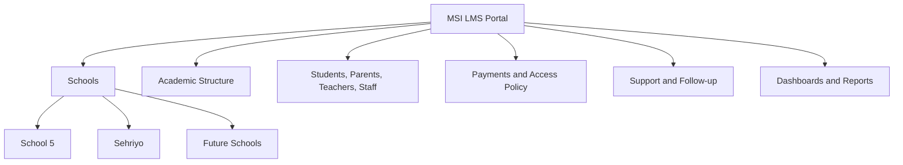
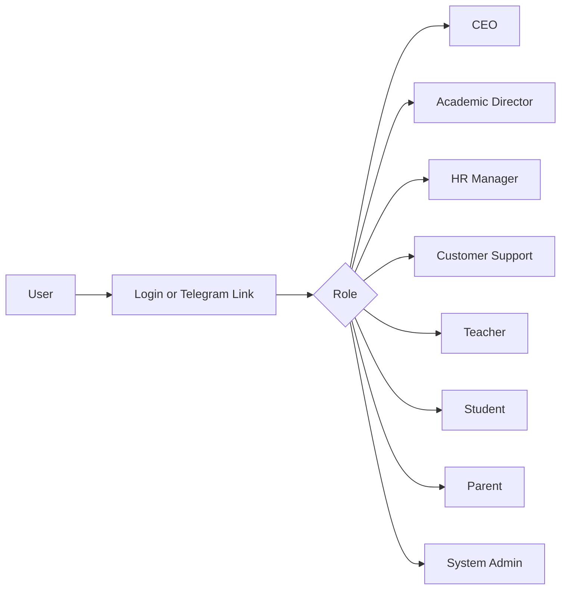

# CEO Product Vision

Audience: CEO and business leadership.

Project: MSI LMS Portal.

## Vision Statement

MSI LMS Portal is a multi-school IGCSE learning management platform designed to make MSI's academic and operational work visible, reliable, and scalable.

The product should answer one leadership question:

```text
What is happening in the company right now, and what needs attention?
```

## Business Goals

MSI LMS Portal should help MSI:

- Support more schools without multiplying manual work.
- Give parents clearer visibility into their children's progress.
- Give students reliable access to their academic statistics.
- Give teachers structured workspaces for their assigned groups.
- Give Academic Director full academic oversight.
- Give Customer Support a clear parent/payment/follow-up workflow.
- Give HR Manager a structured teacher hiring and development flow.
- Give CEO broad visibility across students, teachers, parents, subjects, exams, payments, and operations.

## Current Implementation

The current system already has:

- FastAPI backend.
- React/Vite frontend.
- aiogram Telegram bot.
- PostgreSQL database.
- Migrated academic statistics for School 5 and Sehriyo.
- Student dashboard foundations.
- Parent Telegram link foundations.
- Internal admin-style management screens.

The current system is useful, but it mixes responsibilities. The rebuild should make roles and domains clean.

## Target Product Model



## Role-Based Platform

Each user should enter one workspace based on one role.



## Role Value

### CEO

CEO needs broad company visibility:

- Student growth and activity.
- Teacher overview.
- Parent/payment status.
- Subject and exam performance.
- Support and operational risks.

Default view can be aggregated. Detailed drilldown should be allowed and audit logged.

### Academic Director

Academic Director needs full academic access for v1:

- Subjects.
- Groups/classes.
- Lessons.
- Attendance.
- Homework.
- Exams.
- Progress.
- Teacher academic performance.

### Customer Support

Customer Support is B2C support:

- Parents.
- Payments.
- Warnings.
- Follow-up.
- Support tickets.

Customer Support should not directly change academic structure by default.

### HR Manager

HR Manager needs teacher hiring and development tools:

- Candidate pipeline.
- Teacher academy.
- Evaluations.
- Promotion readiness.

### Teacher

Teachers need one account each:

- Login format: `TCH0001`, `TCH0002`, etc.
- A teacher can teach multiple subjects.
- Teacher sees assigned groups and teaching work.

### Student

Students log in with MSI code plus password.

Student code should be globally unique.

### Parent

Parents are Telegram-first in the first rebuild.

Parent access should be simple:

- Generated student invite link.
- Telegram identity verification.
- Parent linked to child.
- Parent sees only linked children.

Parents can have children across multiple schools.

### System Admin

System Admin is internal operator/superuser.

This is not a normal LMS business role.

## Payments As A Core Product Area

Payments must be connected to:

- Parent follow-up.
- Support tickets.
- Warnings.
- Access policy.
- CEO visibility.

The system should use:

- Agreements.
- Invoices.
- Payments.
- Warnings.
- Access restrictions.

It should not randomly block students from routes without a policy record.

## Future Product Vision

Future modules:

- AI support for learning and operations.
- Google Slides generation for lesson/content workflows.
- Adaptive learning based on student progress.

These modules should be built only after the core PostgreSQL-first LMS is stable.

## Product Principle

The platform must be easy to extend without damaging the architecture.

New schools, new roles, new subjects, and future modules should be added through clear domain boundaries, not long mixed files.
