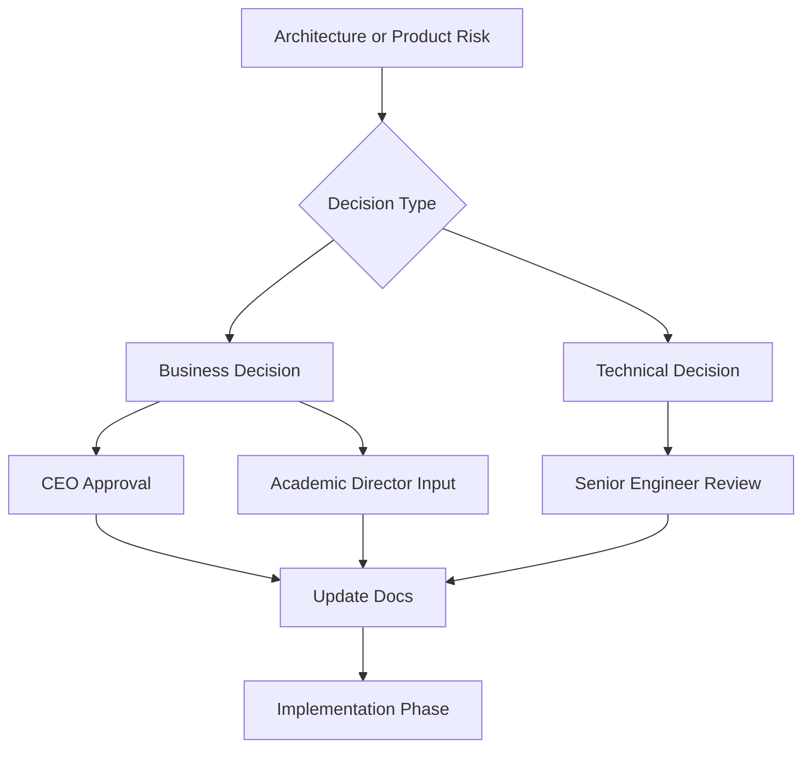

# CEO Risks And Decisions

Audience: CEO and business leadership.

Project: MSI LMS Portal.

## Purpose

This document lists the key risks and decisions that need leadership attention before implementation begins.

## Current Implementation Risks

### Mixed Roles

Current implementation still uses `admin` for several different meanings:

- internal operator work.
- broad management UI.
- placeholder business role views.

Target decision:

- Use `system_admin` only for internal platform operation.
- Create real LMS workspaces for CEO, Academic Director, HR Manager, Customer Support, Teacher, Student, and Parent.

### Payment Model Not Final

Payment management is required, but the final policy must be agreed before coding.

Risk:

- If payment blocking is hardcoded, it will be hard to audit and change.

Target decision:

- Use invoices, warnings, agreements, and access restrictions.
- Routes should ask policy for decisions.

### Customer Support Authority

Customer Support is B2C support:

- parents.
- payments.
- warnings.
- follow-up.
- support tickets.

Decision:

- Customer Support can request B2C access restrictions.
- CEO or Academic Director must approve the restriction.
- After approval, Customer Support can continue handling the B2C parent/payment/support workflow.

### B2B Contract Escalation

Confirmed:

- B2B unpaid school contract issues escalate to CEO only.
- The system should not automatically block a whole school.

Risk:

- If B2B and B2C payments are mixed, support staff may accidentally handle contract issues that require CEO decision.

### Parent Invite Authority

Parents are linked through generated student invite links.

Decision:

- CEO can generate parent invite links.
- Academic Director can generate parent invite links.
- Customer Support can generate parent invite links.

### Account Model

Confirmed decision:

- All login identities should use one shared account model.
- Role-specific information should stay in separate profiles.
- Each user still has exactly one role.

Business impact:

- One account model is cleaner long term and is now approved.
- Migration must be careful so current student, teacher, parent, and staff access is not broken.

### Duplicate Exam Keys

Known issue:

- Duplicate exam keys exist from historical data.

Decision:

- Do not clean yet.
- Investigate later with a dedicated report.

Risk:

- Cleaning without a report could damage historical academic records.

## Business Risks

### Scope Creep

AI, Google Slides, and adaptive learning are future modules.

Risk:

- Building them too early could delay the core LMS.

Decision:

- Build core roles, payments, parent linking, and reports first.

### Data Privacy

The portal contains student, parent, payment, and academic data.

Risk:

- Accidental exposure in docs, logs, screenshots, or exports.

Policy:

- Do not expose secrets, database URLs, tokens, student names, parent phone numbers, Telegram IDs, raw grades, or row-level private data in documentation.

### Operational Trust

Parents and schools will trust the platform only if data is accurate.

Risk:

- Incorrect payment restrictions or incorrect academic statistics can create business conflict.

Policy:

- Use PostgreSQL as source of truth.
- Keep imports auditable.
- Verify migrations.
- Log sensitive drilldowns and changes.

## Decision Flow

## Required Decisions Before Implementation

Resolved:

- Parent invite links can be generated by CEO, Academic Director, and Customer Support.
- Customer Support requests B2C restriction approval from CEO or Academic Director.
- B2C restriction follows two warnings: incoming payment warning, then final few-days warning, then restriction until payment is completed.
- One shared account model is approved for all login identities.

Still required:

1. Which CEO drilldowns require audit events?
2. Which payment reports are required in CEO v1?
3. Which academic views are required in Academic Director v1?

## CEO Takeaway

The rebuild should not start until the above decisions are reviewed.

Clear decisions now will make implementation faster, safer, and easier to verify.
