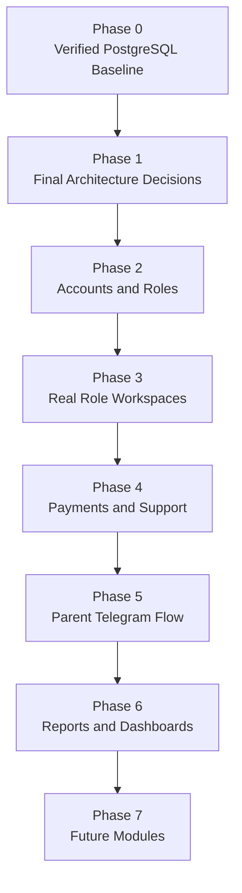

# CEO Roadmap

Audience: CEO and business leadership.

Project: MSI LMS Portal.

## Roadmap Summary

The rebuild should happen in phases.

The goal is to protect the verified PostgreSQL academic data while building a clean role-based LMS around it.

## Roadmap Diagram

## Phase 0: Current Verified Baseline

Status: current.

What is done:

- Academic Excel statistics migration is complete and verified.
- PostgreSQL is the working academic source.
- School 5 and Sehriyo academic statistics are in the database.
- Excel and Google Sheets are no longer live runtime dependencies.

Business value:

- MSI has a real database foundation.
- Academic reporting can move away from fragile spreadsheets.

## Phase 1: Final Architecture Decisions

Status: current planning.

Decision status:

- Account model is decided: one shared account record for every login user, with separate role-specific profiles.
- Parent invite permissions are decided: CEO, Academic Director, and Customer Support.
- Customer Support access restriction authority is decided: request approval from CEO or Academic Director.
- B2C warning policy is decided: incoming payment warning, final few-days warning, then restriction until payment is completed.
- Confirm CEO drilldown and audit expectations.

Business value:

- Prevents expensive rework.
- Ensures the rebuild matches how MSI actually operates.

## Phase 2: Accounts And Roles

Goal:

- One user, one role.
- Real workspaces for real roles.
- `system_admin` separated from LMS business work.

Includes:

- Student MSI code login.
- Teacher `TCH0001` login.
- Telegram-first parent access.
- Staff logins for CEO, HR Manager, Customer Support, Academic Director.

Business value:

- Clear security.
- Less confusion.
- Easier onboarding.

## Phase 3: Real Role Workspaces

Goal:

- Replace admin preview modes with real role workspaces.

Priority:

1. CEO.
2. Academic Director.
3. Customer Support.
4. HR Manager.
5. Teacher.
6. Student.
7. Parent.
8. System Admin.

Business value:

- Every person sees the tools they need.
- No one works from a confusing shared admin screen.

## Phase 4: Payments And Support

Goal:

- Make payment follow-up and access decisions structured.

Includes:

- Payment agreements.
- Invoices.
- Payment records.
- Warnings.
- Follow-up tasks.
- Support tickets.
- Access restrictions controlled by policy.

B2C:

- Customer Support handles parent/student payment support.

B2B:

- Unpaid school contract issues escalate to CEO only.
- No automatic whole-school blocking.

Business value:

- Better collection process.
- Better parent communication.
- Better CEO visibility.
- Lower operational risk.

## Phase 5: Parent Telegram Flow

Goal:

- Make parent onboarding simple and reliable.

Flow:

- Staff generates invite.
- Parent opens Telegram/Mini App link.
- Parent is linked to child.
- Parent sees only linked children.

Business value:

- Easier parent access.
- Less manual support.
- Stronger parent engagement.

## Phase 6: Reports And Dashboards

Goal:

- Give leadership and academic staff reliable visibility.

Dashboard areas:

- CEO company overview.
- School performance.
- Subject performance.
- Student progress.
- Teacher overview.
- Parent/payment status.
- Support risks.

Business value:

- Better decision making.
- Faster issue detection.
- Stronger academic operations.

## Phase 7: Future Modules

Future modules:

- AI.
- Google Slides.
- Adaptive learning.

These should start only after core roles, payments, support, parent linking, and reporting are stable.

## Roadmap Rule

Do not build future modules before the core LMS is stable.

The first rebuild must prioritize:

- Data correctness.
- Role clarity.
- Payment/support workflows.
- Parent access.
- CEO visibility.
