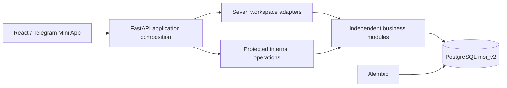

# Current Architecture

Date: 2026-07-10

Branch: `FastAPI-Run-System`

Production reference: `main` (read-only)

## System Shape



PostgreSQL is the only LMS data source. Google Sheets and Excel are not runtime or import integrations. Telegram remains an authentication and notification adapter; it does not define the portal architecture.

## Business Workspaces

The portal has exactly seven business workspaces:

| Workspace | Canonical role | Page root |
| --- | --- | --- |
| CEO | `ceo` | `/ceo` |
| Academic Director | `academic_director` | `/academic-director` |
| Head of Departments | `head_of_department` | `/head-of-departments` |
| Customer Support | `customer_support` | `/customer-support` |
| HR Manager | `hr_manager` | `/hr-manager` |
| Student | `student` | `/student` |
| Parent | `parent` | `/parent` |

Teacher is staff data managed by Academic Director, Head of Departments, and HR workflows. It is not a login role or workspace. Existing teacher accounts are disabled and migration `0008_remove_teacher_portal` invalidates their sessions.

System Admin is a protected internal-operations boundary at `/internal/operations`. It is intentionally separate from the seven business workspaces and cannot preview or impersonate them through UI mode switching.

## Backend Ownership

```text
backend/
  application/                  FastAPI router/page composition
    api.py                      composes module and workspace APIs
    registry.py                 composes page registrations
    system_api.py               health/status boundary
    system_page.py              public/system pages
  workspaces/                   thin role-aware HTTP/page adapters
    ceo/
    academic_director/
    head_of_departments/
    customer_support/
    hr_manager/
    student/
    parent/
  modules/                      independent business capabilities
    accounts/                   login, password, Telegram account auth
    academics/                  schools, programs, groups, schedules, gradebook
    communications/             announcements and chat
    complaints/                 complaint workflows
    learning_resources/         resources, comments, upload progress
    parent_access/              parent identity and child access
    payments/                   payment rules and persistence
    reporting/                  cross-feature read models and summaries
    staff_records/              teachers, candidates, development records
    student_records/            student profiles, dashboards, activity
  internal_operations/          protected System Admin pages/forms/APIs
  core/                         config, database, sessions, rendering, guards
  integrations/                 Telegram and object-storage adapters
  static/                       generated frontend build
```

The deleted technical-layer trees—`backend/api`, `backend/pages`, `backend/services`, `backend/repositories`, and `backend/schemas`—must not be recreated. Each module owns its schemas, services, repositories, and public contract together.

Dependency direction:

```text
application -> workspace/internal adapter -> public module service/contract -> module repository -> PostgreSQL
```

Rules:

- workspace and application adapters contain no SQL;
- a module may import another module's public service or contract, never its repository;
- repositories are private persistence details of their owning module;
- `backend/core` contains cross-cutting infrastructure, not business workflows;
- Alembic is the only DDL owner.

## Frontend Ownership

```text
frontend/src/
  app/                         bootstrap parsing and lazy page registry
  workspaces/                  the seven business workspace entry pages
  features/                    reusable business workflows and panels
  internal_operations/         protected System Admin UI
  shared/                      accessible UI, routes, API, time, motion
```

There is no `frontend/src/roles` tree and no Teacher page bundle. Workspace entry pages compose reusable features through explicit props and API contracts. Authorization remains server-side.

Shared UI owns responsive shells, mobile safe areas, accessible dialogs and menus, 44px touch targets, responsive table/card switching, chart containers, loading/empty states, and reduced-motion behavior.

## Identity and Password Flow

`msi_v2.accounts` is the sole credential authority. Password-enabled accounts may be provisioned with `password == login`; `must_change_password` then forces `/account/security` before workspace access. The user changes the password through `PATCH /api/v1/auth/password`.

Sessions carry canonical account identity, canonical role, profile identity, and `session_version`. Password changes/resets, role changes, disablement, and teacher-portal removal invalidate older sessions.

## Data and Compatibility Boundaries

- `students.id` is the canonical student identity for authorization and writes.
- Public dashboard/enrollment IDs and selected legacy row IDs remain only at explicit HTTP compatibility boundaries.
- Student coins are aggregated once per student across subjects; a group on a coin event is provenance, not a separate balance.
- Group, schedule, attendance, homework, exam, and result data comes from PostgreSQL with `Asia/Tashkent` date/time rules.
- Canonical page URLs are used for all seven workspaces. Old `/hr`, `/support`, and singular `/head-of-department` page URLs are compatibility redirects only.
- Some `/admin/*` HTML form routes remain compatibility entry points into protected internal operations; new JSON mutations use `/api/v1/*`.

## Verification

```bash
APP_ENV=test APP_SECRET_KEY=test-secret python3 -m pytest -q
python3 -m compileall -q backend database tgbot scripts main.py
npm --prefix frontend run test:logic
npm --prefix frontend run test:schedule
npm --prefix frontend run test:shared-ui
npm --prefix frontend run test:academic
npm --prefix frontend run check-types
npm --prefix frontend run build
git diff --check
```
