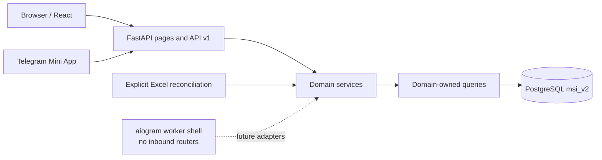

# Current Architecture

Date: 2026-07-10

Branch documented: `FastAPI-Run-System`

Production reference: `main` (read-only)

## System Shape



The LMS is a web portal with Telegram integration, not a Telegram mini app backed by Google Sheets. PostgreSQL is the canonical runtime store. Excel files enter only through explicit import/reconciliation code, and the bot worker currently starts with an empty router registry.

## Backend Ownership

```text
backend/
  main.py                           entrypoint: app = create_app()
  server.py                         app composition and security middleware
  core/                             cross-cutting infrastructure only
    config, database, session       settings, PostgreSQL pool, session helpers
    access/                         roles, permissions, CurrentUser dependencies
    api_schemas, api_responses      ApiSuccess/ApiError envelope
    request_context, rendering      request contextvar + prime_body_state, React page rendering
    passwords, rate_limit, assets   werkzeug-quarantined hashing, limiter, asset versioning
  api/v1/                           ALL JSON routes, one package per feature
    router.py                       aggregates every feature router under /api/v1
    registry.py                     page-route registration for server.py
    students/  teachers/  admin/    academics/  staff/  parents/  identity/
    payments/  complaints/  resources/  announcements/  communication/
    office_hours/  teacher_academy/  system/
  pages/                            ALL HTML/React bootstrap routes, per feature
  schemas/                          ALL Pydantic request/response models, one file per feature
  services/                         ALL business logic, one package per feature
  repositories/                     ALL SQL, one file per feature
  integrations/                     Telegram, Excel, and storage adapters
  static/                           built frontend artifacts
```

The dependency rule is api/pages -> services -> repositories -> PostgreSQL, with
`core` importable from every layer and importing none of them. Schemas are shared
by api and services. Feature names line up across layers: the students feature is
`api/v1/students/*`, `pages/students/*`, `schemas/students.py`,
`services/students/*`, `repositories/students.py`.

`database/__init__.py` is only a small stable re-export of core connection
helpers; schema history lives under `database/alembic`.

## Authentication Boundary

`msi_v2.accounts` is the canonical login record for all roles. Separate `student_profiles`, `teacher_profiles`, `parent_profiles`, and `staff_profiles` connect an account to its business entity.

Password-enabled accounts use:

1. canonical login lookup;
2. password-hash verification from `accounts.password_hash`;
3. active account and active profile checks;
4. a minimal, versioned session;
5. a forced `/account/security` flow when `must_change_password` is true.

Changing or resetting a password increments `session_version`. Middleware checks the current account status, role, and version on authenticated requests so older cookies are rejected.

Telegram sign-in resolves a verified `account_telegram_links` row to the same canonical account/profile/session model. Telegram does not maintain a second account authority.

## Student Identifier Rules

Three student identifiers can appear, and they are not interchangeable:

| Identifier | Purpose |
| --- | --- |
| `students.id` / `student_db_id` | canonical internal identity used for authorization and relational writes |
| `legacy_student_row_id` / route name `student_row_id` | compatibility value at older admin/parent HTTP boundaries |
| `group_students.legacy_public_dashboard_id` / enrollment ID | public dashboard route compatibility |

Routes that still accept a legacy row ID must resolve it to `students.id` before applying policy or writing relational data. New domain APIs should accept canonical IDs unless they are explicitly maintaining a public compatibility contract.

## Parent Invite Boundary

`/parent/invite/{code}` is the only public invite route. The raw code exists only in the URL/user handoff; PostgreSQL stores its SHA-256 digest. Loading requires a pending, unexpired invite. Claiming locks the invite row, creates or updates the parent and child link, provisions the canonical account and optional Telegram link, consumes the invite, and returns a versioned session in one database transaction.

The old signed `/parent/link/{token}` routes and plaintext invite-token storage are gone. A manual form claim remains available from the invite page; Telegram claims additionally require verified, fresh Mini App `initData`.

## API and Page Boundaries

- JSON/action endpoints live under `/api/v1/*`.
- Page routes live under `backend/pages` or the remaining admin page registry.
- The runtime has no `/admin/api`, `/teacher/api`, `/student/api`, `/academic-director/api`, `/head-of-department/api`, or bare non-versioned `/api/*` endpoints.
- Some old HTML form actions remain under `/admin/*`. They are page compatibility routes, not a second JSON API.
- `tests/route_snapshot.txt` is the checked-in runtime route contract.

## Frontend Architecture

```text
frontend/src/
  app/                              bootstrap parsing and lazy page registry
  roles/                            role-owned pages and panels
  shared/api/                       canonical API route helpers
  shared/lib/                       bootstrap, timezone, metric, motion, Telegram helpers
  shared/ui/                        accessible shells, dialogs, cards, charts, tables, navigation
```

The backend embeds a JSON bootstrap payload; React resolves a lazy-loaded page instead of inferring business authorization in the browser. Server role and object guards remain authoritative.

Shared UI behavior includes:

- responsive desktop sidebar, mobile drawer/bottom navigation, and Telegram safe areas;
- minimum 44px touch targets for interactive primitives;
- keyboard-accessible dialogs, menus, drawers, and pagination;
- reduced-motion fallbacks for transitions and chart/page animations;
- responsive tables/cards and Recharts containers;
- metric helpers that preserve valid zero values;
- `Asia/Tashkent` calendar/week/office-hour conversion independent of browser timezone;
- no invented lesson start times when source data has none.

## Database and Migration Boundary

Alembic is the only DDL owner. The current chain is:

```text
0001 baseline -> 0002 lesson source metadata -> 0003 shared accounts
-> 0004 HOD subject scopes -> 0005 canonical identity
-> 0006 secure parent invites -> 0007 LMS integrity constraints
```

Runtime table/index bootstrap functions have been removed. Deployment applies `python -m alembic upgrade head` before starting the web process.

## Integrations

- Telegram web authentication: active, HMAC-verified, replay-limited, canonical-account based.
- Telegram Mini App parent linking: active through `/parent/invite/{code}` and the `parent_` start parameter.
- Telegram inbound bot commands: not implemented; `tgbot.routing.BOT_ROUTERS` is empty.
- Teacher Academy outbound Telegram notifications: best-effort integration and independent of inbound handlers.
- Google Sheets runtime access: retired.
- Excel: explicit curriculum/reconciliation/import boundary only.
- Object storage: adapter used by resource workflows where configured.

## Deliberately Retained Compatibility

- Physical schema name `msi_v2`.
- Legacy source columns used to correlate migrated records.
- Public dashboard/enrollment IDs and a few `student_row_id` HTTP parameters.
- Remaining admin HTML form routes and workspace helper services.
- `auth_role="admin"` session compatibility for `system_admin` presentation routing.

These are named boundaries, not alternate sources of truth.

## Current Verification Commands

```bash
python3 -m pytest
python3 -m compileall -q backend database tgbot scripts main.py
python -m alembic current
python -m alembic heads
npm --prefix frontend run check-types
npm --prefix frontend run build
git diff --check
```

Workbook parity is intentionally not asserted here. Use the reconciliation report and investigate every ambiguous or mismatched identity/date/result before any transactional apply.
