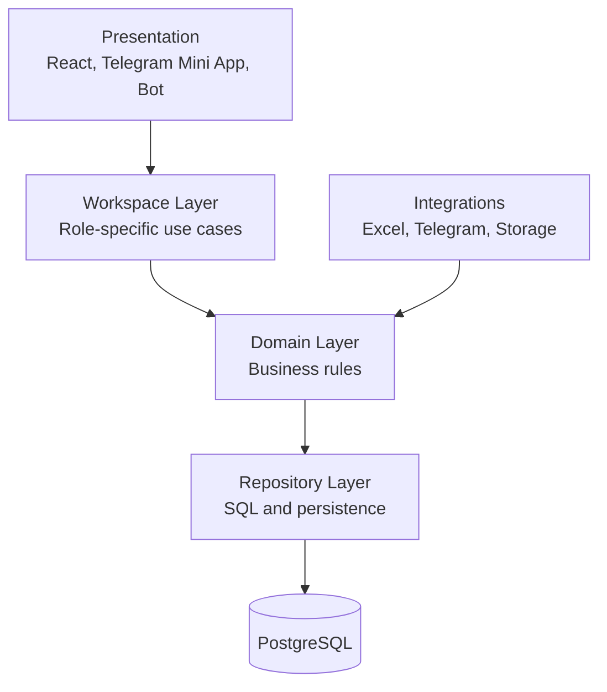
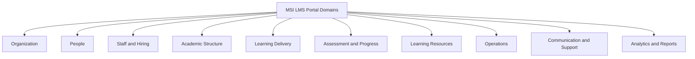

# Engineering Architecture

Audience: senior engineers.

Project: MSI LMS Portal.

## Current Implementation

The current branch has useful modules but blurred boundaries.

Current runtime:

```text
React/Vite frontend -> FastAPI backend -> PostgreSQL
Telegram bot --------^
Excel imports -----------------------> PostgreSQL
```

Current implementation issues:

- `backend/roles/admin` is a large mixed management area.
- The current code name `admin` mixes internal operator and LMS management.
- `system_admin` is the target documentation/architecture name.
- Bot imports backend identity services directly.
- Permissions are duplicated across identity/security modules.
- Some SQL still appears too close to route logic.

## Target Architecture Layers



## Layer Responsibilities

### Presentation

Owns:

- React pages.
- Telegram Mini App rendering.
- Telegram bot messages/buttons.

Does not own:

- authorization policy.
- payment restriction rules.
- SQL.

### Workspace

Owns role-specific workflows:

- CEO workspace.
- Academic Director workspace.
- HR Manager workspace.
- Customer Support workspace.
- Teacher workspace.
- Student workspace.
- Parent workspace.
- System Admin workspace.

### Domain

Owns business rules:

- organization.
- people.
- staff and hiring.
- academic structure.
- learning delivery.
- assessment and progress.
- learning resources.
- operations.
- communication and support.
- analytics and reports.

### Repository

Owns:

- SQL statements.
- mapping database rows to domain objects.
- transaction boundaries where appropriate.

### Database

Owns:

- canonical persisted state.
- constraints.
- foreign keys.
- audit records.

## Domain Block Map



## Target Dependency Rules

Allowed:

```text
frontend -> HTTP -> backend
tgbot -> domain service adapter -> domain
workspace -> domain
domain -> repository
repository -> PostgreSQL
scripts/imports -> import service -> domain/repository
```

Forbidden:

```text
tgbot -> backend web routes
backend web routes -> tgbot
frontend -> Python imports
domain -> FastAPI Request/session
domain -> React/browser code
route -> complex raw SQL
```

## Target Folder Structure

Proposed:

```text
backend/
  app/
    core/
    api/
    domains/
    workspaces/
    integrations/

database/
  alembic/
  repositories/

frontend/src/
  app/
  design-system/
  roles/
  shared/

tgbot/
  handlers/
  keyboards/
  services/

scripts/
  imports/
  reports/
```

The folder move is not required before all decisions are approved. Ownership can be improved before physical moves.

## Current To Target Mapping

| Current area | Target owner |
|---|---|
| `backend/roles/admin` | split into workspaces and domains |
| `backend/domains/academics` | Academic Structure, Delivery, Assessment |
| `backend/domains/payments` | Operations |
| `backend/domains/resources` | Learning Resources |
| `backend/domains/complaints` | Communication and Support |
| `backend/identity` | Identity and Access domain |
| `database/queries` | Repository layer |
| `scripts/sync_gradebooks_from_excel.py` | Excel import integration |
| `tgbot` parent linking | Telegram integration + Parent Linking domain |

## Target Architecture Rule

Do not build new features by extending the current mixed admin workspace unless explicitly part of a transition phase.
