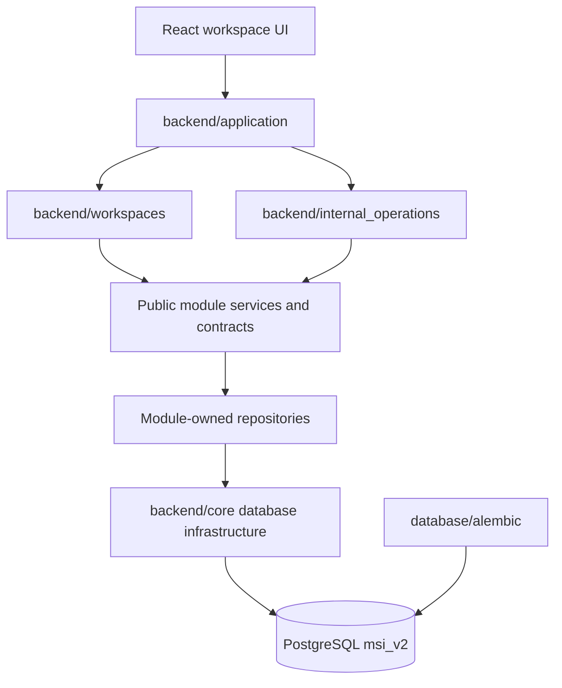

# Engineering Architecture

Audience: senior engineers.

## Implemented Dependency Graph



## Ownership Rules

Allowed:

```text
frontend workspace -> versioned HTTP/page contract
application -> workspace, module API, or internal-operations registration
workspace/internal adapter -> public module service or contract
module service -> same-module repository
module service -> another module's public contract
module repository -> backend.core.database -> PostgreSQL
Alembic -> schema DDL
```

Forbidden:

```text
workspace/application -> raw SQL
module -> another module's repository
frontend -> Python module or database
runtime request -> CREATE/ALTER/DROP
business module -> React/browser state
password authentication -> role-profile legacy hash
new code -> backend/api, pages, services, repositories, or schemas
```

## Layer Responsibilities

### Application

`backend/application` is the composition root. It registers module APIs, the exact seven workspace APIs/pages, protected internal operations, and system endpoints. It contains no business rules or persistence.

### Workspaces

`backend/workspaces` contains role and object-aware page/API adapters for CEO, Academic Director, Head of Departments, Customer Support, HR Manager, Student, and Parent. A workspace orchestrates public module contracts; it does not own shared business logic or SQL.

### Business Modules

Each package in `backend/modules` owns one capability as a complete puzzle piece: schemas, business rules, repository code, and public API/contract functions. Repository modules are private to their owner. Cross-module reads use explicit contracts such as the Academics-to-Reporting contract.

### Internal Operations

`backend/internal_operations` contains System Admin page/form/API adapters. It reuses business modules and reporting contracts. It is not a business workspace and cannot impersonate or preview a business role.

### Core and Alembic

`backend/core` owns technical infrastructure: settings, PostgreSQL connections, sessions, guards, rendering, rate limiting, and response helpers. `database/alembic` is the only owner of schema changes. The active migration chain ends at `0008_remove_teacher_portal`.

## Cross-cutting Boundaries

### Identity

`backend/modules/accounts` owns the canonical account, password, Telegram-login, and session-version lifecycle. Teacher profiles remain staff data, but Teacher is not an authenticatable portal role.

### Students and Parents

Authorization uses canonical `students.id`. Legacy row/public enrollment IDs are resolved at compatibility routes. Parent access always checks the active child link.

### Academics and Reporting

Academics owns schools, subjects, programs, groups, schedules, attendance, homework, exams, and coin-event rules. Reporting owns read models and summaries. Reporting accesses academic data through `backend.modules.academics.reporting_contract`, not the academic repository.

### Time

Database instants are timezone-aware. Browser date/week logic uses `Asia/Tashkent`. Missing source times remain missing; the UI never invents lesson times.

### Frontend

The backend embeds a typed bootstrap payload and React lazy-loads a named page. Workspace entry pages live under `frontend/src/workspaces`, reusable workflows under `features`, internal administration under `internal_operations`, and accessibility/responsive primitives under `shared`.

### Integrations

Telegram verification and notifications belong in integration adapters. PostgreSQL is the only academic data source; there is no Excel or Google Sheets integration.
