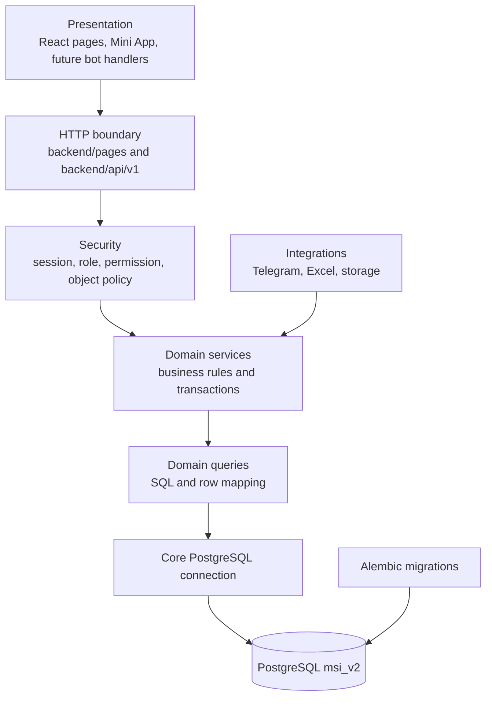

# Engineering Architecture

Audience: senior engineers.

## Implemented Layers



## Dependency Rules

Allowed:

```text
frontend -> HTTP
pages/API -> security and domain services
domain services -> same-domain or explicitly shared domain services
domain services -> domain query modules
domain queries -> backend.core.database -> PostgreSQL
integrations/import scripts -> domain services
Alembic -> schema DDL
```

Forbidden:

```text
frontend -> Python modules or database
route -> runtime CREATE/ALTER/DROP
domain -> React/browser state
domain -> ambient FastAPI Request/session
tgbot -> web route functions
password authentication -> role-table legacy hashes
new code -> deleted database/identity facades
```

## Layer Responsibilities

### Pages and API

- authenticate and validate request shape;
- enforce role/permission dependencies;
- resolve explicit compatibility identifiers;
- call domain services;
- render React bootstrap data or return API envelopes.

Routes do not own academic, payment, invite, or password transactions.

### Domain Services

- enforce object policy and business invariants;
- coordinate transactions;
- compose payloads for pages/APIs;
- call query modules and integration adapters.

### Domain Queries

- own raw SQL for their domain;
- map database rows;
- expose focused persistence operations;
- never create schema objects during a request.

### Core and Alembic

`backend/core/database.py` owns PostgreSQL connections/pooling. `database/alembic` owns the frozen baseline and every DDL revision. `database/__init__.py` is only a narrow connection compatibility export.

## Cross-cutting Architecture

### Identity

`accounts` is the single password/session authority. Profile tables attach business entities. Telegram links resolve to the same account. Session versions make account changes immediately invalidate old cookies.

### Student Data

Internal policy uses canonical `students.id`. Public enrollment IDs and legacy row IDs are resolved at HTTP/import boundaries and never substituted for ownership.

### Time

Database instants are timezone-aware. UI calendar/week logic uses `Asia/Tashkent`. Date-only source data remains date-only, and missing lesson times remain missing.

### Frontend

FastAPI embeds a typed bootstrap payload; React lazy-loads the named page. Shared UI components own accessible dialogs, menus, drawers, navigation, tables/cards, chart containers, touch targets, responsive safe areas, and reduced-motion behavior.

### Integrations

Telegram protocol verification belongs in integration adapters; parent/account policy belongs in domains. Excel parsing/reconciliation is explicit tooling, not an alternate runtime repository.

## Transitional Boundaries

`backend/roles` still contains admin page/form and workspace helper code. Move each slice only after routes, domain ownership, frontend behavior, and tests have an equivalent destination. Do not create speculative folder churn solely to make the tree look pure.
