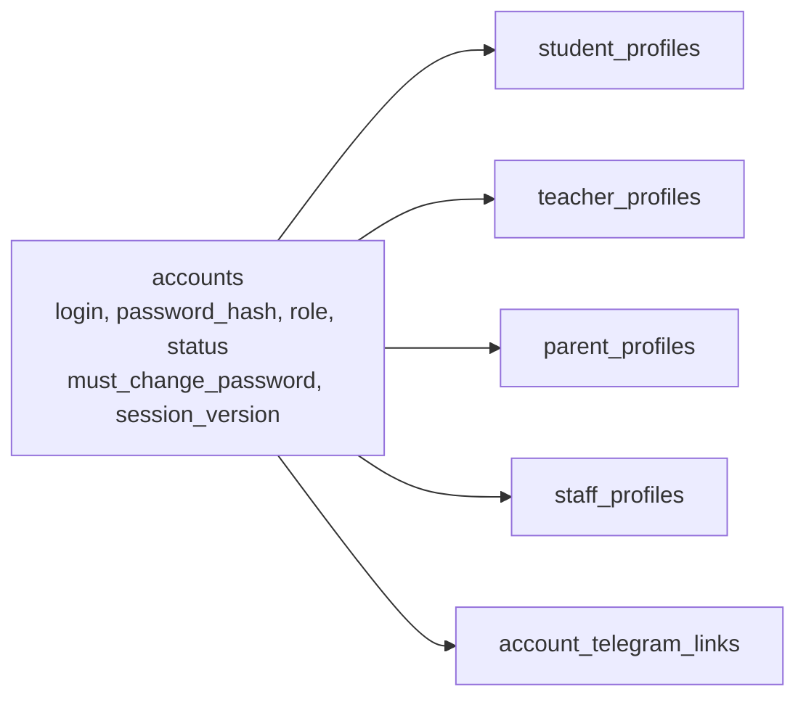
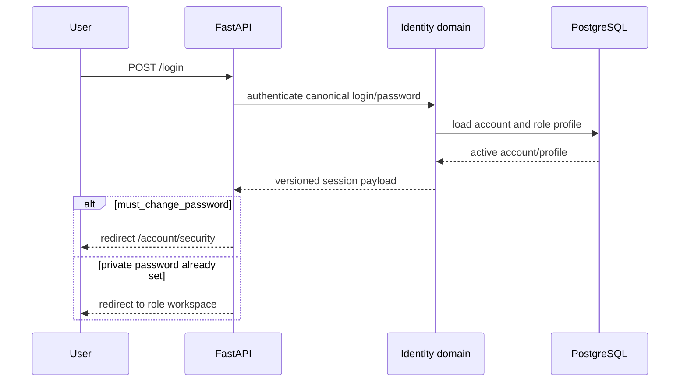

# Engineering Authentication and Roles

Audience: engineers working on identity, authorization, and role workspaces.

## Implemented Identity Model

`msi_v2.accounts` is the sole password authority. Password authentication must not read `students`, `student_auth`, `msi_staff`, or role-specific profile tables for a competing hash.



The role profile proves which business entity the account represents. An account and its profile must both be active before a session is issued.

Canonical password and Telegram code lives in:

- `backend/modules/domains/identity/service.py`
- `backend/modules/domains/identity/repository.py`
- `backend/modules/domains/identity/telegram_auth.py`
- `backend/modules/domains/identity/api.py`

The former `backend/identity/account_auth.py`, `account_telegram_auth.py`, `parent_accounts.py`, `parent_invites.py`, and `telegram_links.py` facades have been removed.

## Roles

Each account has one canonical role:

| Role | Current identity/profile | Workspace scope |
| --- | --- | --- |
| `ceo` | staff profile | executive workspace |
| `hr_manager` | staff profile | recruitment and HR operations |
| `academic_director` | staff profile | full academic management |
| `head_of_department` | staff profile plus subject scopes | subject-scoped academic management |
| `customer_support` | staff profile | parent/support operations |
| `student` | student profile | own academic dashboard and tools |
| `parent` | parent profile | linked children only |
| `teacher` | teacher profile | own read-only Teacher Academy profile |

The former `admin`, `owner`, and `system_admin` values are not valid runtime roles. Migration `0028_remove_system_admin` archives those accounts, revokes their Telegram links, invalidates their sessions, and removes the System Admin workspace and routes.

Teacher profiles remain managed staff records. The current tree permits an active canonical Teacher account to open a read-only Teacher Academy profile at `/teacher`; it does not grant academic-management mutations.

## Password Lifecycle

New Student, staff, and Teacher provisioners use the canonical login as the initial password and set `must_change_password=true`. The migration does not blindly reset existing independently changed credentials:

- student/staff hashes that already verify their login are marked for change;
- independently changed canonical hashes are preserved;
- newly provisioned Teacher credentials follow the same forced-change lifecycle;

Parents are Telegram-first. A parent always receives a canonical account/profile, but a Telegram-only or manual-invite parent can legitimately have no password login. If a parent is later given a password credential, the same canonical password lifecycle and self-service endpoint apply.

### First Sign-in



While `must_change_password` is true, middleware allows only the security page, auth endpoints, static assets, and logout. Other API calls return `428 password_change_required`; page requests redirect to `/account/security`.

### Self-service Change

`PATCH /api/v1/auth/password` is available to every signed-in, password-enabled canonical account. It:

1. requires the current password;
2. validates confirmation and minimum length;
3. locks the account row;
4. writes a new hash to `accounts.password_hash`;
5. clears `must_change_password`;
6. increments `session_version`;
7. records an `account.password_changed` audit event;
8. updates the current cookie to the new version.

Authorized role-specific student resets use the same account authority, set `must_change_password=true`, increment `session_version`, and audit `account.password_reset`.

## Versioned Sessions

The Starlette session contains only identity/routing facts required by the current application. Canonical fields include:

- `account_id`
- `account_role` / `canonical_role`
- `auth_login`
- `must_change_password`
- `session_version`
- one role profile identifier, such as `student_db_id`, `parent_id`, or `staff_id`

Student sessions use canonical `students.id` as `student_db_id`. A public enrollment/dashboard ID can be included separately as `student_enrollment_id`; it is never the authorization identity.

On authenticated requests, middleware reloads the canonical account and verifies:

- account status is active;
- cookie `session_version` matches the database;
- cookie canonical role matches the account role.

A mismatch clears the cookie and returns `401 session_expired` for APIs or redirects page requests to login. This invalidates old cookies after password changes/resets, role changes, and account disablement.

## Telegram Authentication

Telegram is another authentication method for the same account, not a parallel user database:

1. the server verifies raw Mini App `initData` using the bot-token HMAC and configured age window;
2. the verified Telegram user ID resolves an active `account_telegram_links` row;
3. identity loads the same active account and role profile used by password login;
4. identity builds the same versioned session payload.

Never trust `initDataUnsafe`, a query-string Telegram ID, or a username as identity proof.

## Parent Invite Authentication

Parent invites are public capabilities with strict storage and transaction rules:

- raw invite codes are never stored;
- `account_invites.token_hash` contains a SHA-256 digest;
- invites expire and parent invites are limited to one use;
- `/parent/invite/{code}` replaces the deleted `/parent/link/{token}` flow;
- claiming uses a row lock and atomically creates/updates the parent, child link, canonical account, optional Telegram link, and invite-consumption record;
- parent access still requires an active `parent_student_links` row.

Telegram claims require verified Mini App identity. The manual fallback form can claim the same code without creating a Telegram link; it still receives a canonical account/profile and versioned session.

## Authorization Layers

```text
authentication -> normalized role -> permission guard -> object policy -> domain mutation
```

Examples:

- students can operate only as their canonical `student_db_id`;
- parents can open only linked children;
- HOD actions are restricted to assigned subject scopes;
- student chat membership is verified before room reads/writes;
- group moves cannot cross school or subject-program boundaries;
- payment writes resolve a canonical student before mutation.

Routes must not replace object policy with a role-only check.

## Migration

Alembic `0005_canonical_identity`:

- adds password lifecycle/session-version fields to `accounts`;
- backfills accounts and profiles for students, teachers, staff, and parents;
- preserves independent credentials and repairs only defined initial-login cases;
- links existing verified Telegram identities to canonical accounts;
- removes `msi_v2.student_auth` and `students.password_plain`;
- adds account actors to audit events.

Alembic `0007_lms_integrity` enforces credential requirements for active password roles while explicitly allowing Telegram-first parents without a password. Historical revision `0008_remove_teacher_portal` removed an earlier portal implementation; the current read-only Teacher workspace is application behavior preserved in this working tree.

## Required Tests

Identity changes should cover:

- canonical password login for each current workspace role;
- Teacher access limited to its own read-only Academy profile;
- initial-password redirect and API blocking;
- successful and rejected self-service changes;
- session-version invalidation;
- authorized reset and forced change;
- canonical Telegram account resolution;
- expired, reused, or concurrent parent invite claims;
- parent child-object authorization;
- migration upgrade on a representative pre-`0005` database clone.
