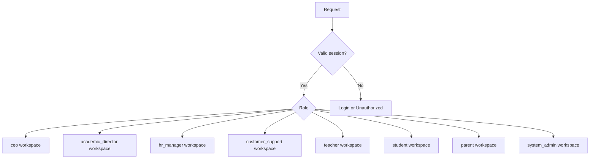
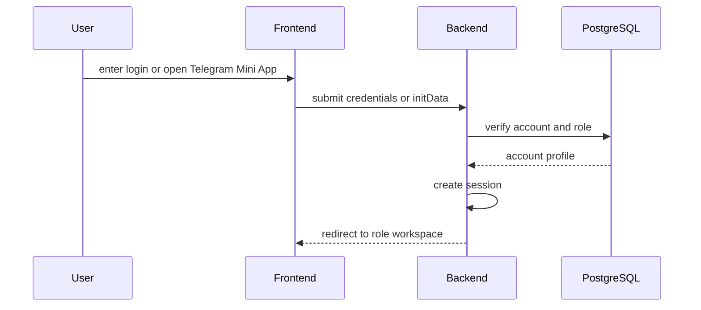

# Engineering Auth And Roles

Audience: senior engineers.

Project: MSI LMS Portal.

## Current Implementation

Current auth uses:

- Starlette session cookie.
- FastAPI middleware for authentication and same-origin checks.
- Role helpers in `backend/identity/roles.py`.
- Guard helpers in `backend/utils/guards.py`.
- Additional security helpers in `backend/security`.

Current issue:

- role and permission logic is duplicated.
- current `admin` naming mixes internal operator and LMS business management.
- parent linking has both web and bot logic.

## Target Decisions

- One user has exactly one role.
- `system_admin` is internal operator/superuser, not an LMS business role.
- Real LMS roles are `ceo`, `hr_manager`, `customer_support`, `student`, `teacher`, `parent`, `academic_director`.
- Students login with MSI code plus password.
- Teachers login with `TCH0001`, `TCH0002`, etc.
- Parents are Telegram-first in v1.
- Parent password login is future.

## Role Workspace Flow



## Login/Auth Flow



## Role Access Summary

| Role | Target access |
|---|---|
| `system_admin` | internal operation, diagnostics, recovery |
| `ceo` | broad company visibility, audited drilldown |
| `academic_director` | full academic access for v1 |
| `hr_manager` | hiring and teacher development |
| `customer_support` | B2C parents, payments, warnings, support |
| `teacher` | assigned teaching work, multiple subjects possible |
| `student` | own dashboard and resources |
| `parent` | linked children only |

## Target Session Data

Session should contain only minimal durable identity:

- `account_id`.
- `role`.
- role profile id when needed.
- `telegram_user_id` when verified and linked.
- created/updated timestamps.

Avoid storing broad business state in session.

## Policy Checks

Authentication answers:

```text
Who are you?
```

Authorization answers:

```text
What role do you have?
```

Policy answers:

```text
Can this role/account perform this action on this object right now?
```

Examples:

- parent can view only linked children.
- teacher can manage only assigned groups.
- customer support can manage B2C support but not academic structure by default.
- customer support can request B2C access restrictions from CEO or Academic Director.
- customer support cannot approve B2C access restrictions directly.
- CEO drilldown should audit sensitive access.
- payment/access restrictions are checked through policy service.

## Target Account Model

Confirmed decision:

- use one physical `accounts` table for every login identity.
- keep role-specific data in separate profile/domain tables.
- enforce exactly one role per account.

Plain-language meaning:

- One shared login table contains every login account, including staff, teachers, students, and future parent password accounts.
- Student, teacher, parent, and staff-specific details stay in their own profile/domain tables.

Engineering direction:

- create a unified account abstraction around the shared `accounts` table.
- link each account to exactly one role-specific profile where needed.
- migrate carefully to preserve current access.

## Migration Notes

Current `admin` code should migrate to:

- `system_admin` for internal platform operation.
- real workspaces for CEO, Academic Director, HR Manager, and Customer Support.

Do not implement role aliases that make business users silently share system admin privileges.
