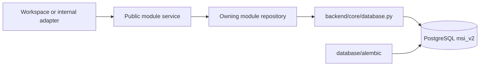

# Engineering Database Architecture

PostgreSQL schema `msi_v2` is the only runtime LMS data source. Google Sheets and Excel are not integrations.

Runtime code does not own schema DDL. Table, index, and constraint changes belong only in Alembic. Workspace and application packages contain no SQL.

## Repository Ownership

| Capability | Repository owner |
| --- | --- |
| accounts and Telegram links | `backend/modules/accounts/repository.py` |
| academics, groups, gradebook | `backend/modules/academics/repository.py` |
| schedules | `backend/modules/academics/timetable_repository.py` |
| office hours | `backend/modules/academics/office_hours_repository.py` |
| reporting and summaries | `backend/modules/reporting/*repository.py` |
| students | `backend/modules/student_records/repository.py` |
| teachers and staff development | `backend/modules/staff_records/*repository.py` |
| parents and invites | `backend/modules/parent_access/repository.py` |
| announcements/chat | `backend/modules/communications/*repository.py` |
| complaints | `backend/modules/complaints/repository.py` |
| payments | `backend/modules/payments/repository.py` |
| resources/comments | `backend/modules/learning_resources/repository.py` |

A module may call another module's public contract, never its repository.

## Migration Chain

Repository migration head is `0008_remove_teacher_portal`:

| Revision | Purpose |
| --- | --- |
| `0001_msi_v2_baseline` | frozen baseline schema |
| `0002_lesson_source_meta` | lesson-session source metadata |
| `0003_shared_accounts` | accounts, profiles, Telegram links, audit foundation |
| `0004_hod_subject_scopes` | Head of Departments subject scopes |
| `0005_canonical_identity` | accounts-only password cutover and versioned sessions |
| `0006_secure_parent_invites` | hash-only expiring parent invites |
| `0007_lms_integrity` | identity, academic, office-hour, and coin constraints |
| `0008_remove_teacher_portal` | disable Teacher accounts and invalidate sessions |

## Identity and Data Rules

- `accounts` is the sole password authority.
- `student_profiles`, `parent_profiles`, and `staff_profiles` attach business identities.
- Teacher profile/staff records remain; Teacher accounts are disabled for portal access.
- `students.id` is the canonical authorization and foreign-key identity.
- legacy row/enrollment/public-dashboard IDs survive only as named compatibility fields.
- student coins are one student-wide ledger, aggregated by `student_id` across subjects.
- group, attendance, homework, exam, schedule, result, and coin reads come from PostgreSQL.

No runtime code may create tables, use a spreadsheet as fallback data, or duplicate a repository in a workspace adapter.
