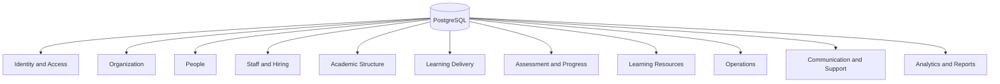

# Engineering Database

Audience: senior engineers.

Project: MSI LMS Portal.

## Current Implementation

Database: PostgreSQL.

Schema: `msi_v2`.

PostgreSQL is the source of truth.

Excel and Google Sheets are import/export sources only.

## Current Important Tables

Identity and people:

- `msi_staff`
- `students`
- `student_auth`
- `parents`
- `parent_student_links`
- `teachers`
- `teacher_subjects`
- `group_teachers`
- `account_invites`
- `telegram_accounts`

Academics:

- `schools`
- `subjects`
- `subject_programs`
- `subject_program_items`
- `groups`
- `group_students`
- `group_schedule_rules`
- `lesson_sessions`
- `attendance_records`
- `homework_scores`
- `exam_results`
- `coin_events`

Operations:

- `payments`
- `support_tickets`
- `ticket_messages`
- `announcements`
- `resources`
- `resource_types`
- `office_hour_slots`
- `office_hour_bookings`

HR:

- `teacher_candidates`
- `teacher_candidate_events`
- `academy_teachers`
- `academy_lesson_assignments`
- `academy_assessments`

## Current Data Status

Academic migration status:

- Excel academic statistics migration is complete and verified.
- School 5 and Sehriyo academic statistics are in PostgreSQL.
- `MONLINE` was included.
- Blank Excel cells are skipped by default.
- Duplicate exam keys are known and not cleaned yet.

No row-level student, parent, payment, Telegram, or grade data should be included in documentation.

## Current Aggregate Counts

Sanitized aggregate counts from current verification:

- Schools: 2.
- Students: 177.
- Groups: 20.
- Subject program items: 696.
- Lesson sessions: 3,672.
- Attendance records: 14,841.
- Homework records: 12,519.
- Exam records: 3,013.
- Payments: 0.

These are aggregate technical counts only.

## Target Schema Blocks

## Target Identity Tables

Proposed:

- `accounts`
- `account_credentials`
- `account_sessions`
- `account_telegram_links`
- `account_invites`
- `role_permissions`
- `audit_events`

Rules:

- one account has one role.
- `system_admin` is internal operator.
- real LMS roles remain separate.
- students use globally unique MSI code.
- teachers use `TCH0001` format.
- parents are Telegram-first in v1.

## Target Organization Tables

Proposed:

- `schools`
- `school_contacts`
- `school_contracts`
- `school_contract_terms`
- `school_contract_events`

Rules:

- support more schools later.
- B2B unpaid contract escalation goes to CEO only.
- do not automatically block entire schools.

## Target People Tables

Proposed:

- `students`
- `student_auth`
- `parents`
- `parent_student_links`
- `teachers`
- `teacher_subjects`
- `staff_profiles`

Rules:

- student code globally unique.
- parent-child relationship many-to-many.
- teacher can teach multiple subjects.

## Target Academic Tables

Proposed:

- `subjects`
- `subject_programs`
- `subject_program_items`
- `groups`
- `group_students`
- `group_teachers`
- `group_schedule_rules`
- `lesson_sessions`
- `attendance_records`
- `homework_scores`
- `exam_results`
- `coin_events`

Rules:

- subjects are universal MSI subjects.
- groups attach to subject programs.
- students are assigned by academic staff, not self-selected.

## Target Payment Tables

Proposed:

- `payment_agreements`
- `invoices`
- `invoice_items`
- `payments`
- `payment_warnings`
- `access_policies`
- `access_policy_decisions`
- `access_restrictions`

Rules:

- no hardcoded route blocking.
- access decisions are policy-backed and auditable.

## Known Database Risks

- Current payment service and schema need alignment before real payment data grows.
- `password_plain` compatibility should be removed from target auth.
- `legacy_*` columns are migration aids, not target business concepts.
- Student auth row coverage needs review.
- Duplicate exam keys should be investigated later with a report.

## Database Safety Rules

- No destructive SQL without explicit approval.
- No row-level private data in docs.
- No secrets or connection strings in docs.
- Backups and CSV dumps must remain uncommitted.
- Use Alembic for schema changes.
