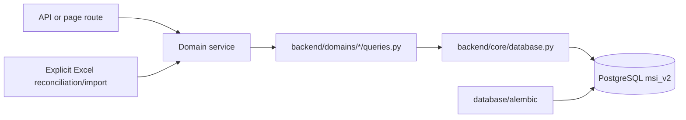

# Engineering Database Architecture

Audience: engineers changing persistence, migrations, imports, or identifiers.

## Current Boundary

PostgreSQL schema `msi_v2` is the runtime source of truth. The schema name is retained for compatibility; it is not evidence that the old architecture is still active.



Runtime code does not own schema DDL. Table, index, and constraint changes belong only in Alembic. The deleted `database/tables.py` runtime bootstrap helpers must not be reintroduced.

The root `database` package now contains:

- `database/__init__.py`: a narrow compatibility export for core connection helpers;
- `database/alembic/`: migration environment, frozen baseline, and revisions.

The old `database/queries` and `database/cross_queries` packages have been removed. SQL ownership moved to the matching domain.

## Domain Query Ownership

| Domain | Query owner |
| --- | --- |
| identity/accounts | `backend/domains/identity/queries.py` |
| academics, programs, groups, gradebook | `backend/domains/academics/queries.py`, `summary_queries.py` |
| students | `backend/domains/students/queries.py` |
| teachers | `backend/domains/teachers/queries.py` |
| parents and invites | `backend/domains/parents/queries.py` |
| timetable | `backend/domains/timetable/queries.py` |
| office hours | `backend/domains/office_hours/queries.py` |
| Teacher Academy | `backend/domains/teacher_academy/queries.py` |
| announcements | `backend/domains/announcements/queries.py` |
| complaints/support | `backend/domains/complaints/queries.py` |
| chat | `backend/domains/communication/chat_service.py` until split further |
| payments | `backend/domains/payments/queries.py` |
| resources/comments | `backend/domains/resources/queries.py` |

Domain services own transaction workflows. A query module may issue SQL but must not create tables at request time.

## Migration Chain

Repository migration head is `0007_lms_integrity`:

| Revision | Purpose |
| --- | --- |
| `0001_msi_v2_baseline` | frozen baseline schema |
| `0002_lesson_source_meta` | source metadata for lesson sessions |
| `0003_shared_accounts` | accounts, role profiles, Telegram links, audit foundation |
| `0004_hod_subject_scopes` | HOD subject-scoped authorization data |
| `0005_canonical_identity` | accounts-only password cutover, profile backfill, versioned sessions, legacy student credential removal |
| `0006_secure_parent_invites` | hash-only, expiring parent invites; plaintext token removal |
| `0007_lms_integrity` | identity, invite, office-hour, enrollment, attendance, homework, exam, and coin constraints/indexes |

`0006` is intentionally irreversible because it deletes plaintext invite material. Rollback requires a pre-migration backup or invite regeneration.

## Canonical Identity Tables

- `accounts`: canonical login, password hash, role, status, password lifecycle, and session version.
- `student_profiles`: account-to-student identity.
- `teacher_profiles`: account-to-teacher identity and `TCH####` code.
- `parent_profiles`: account-to-parent identity.
- `staff_profiles`: account-to-staff identity.
- `account_telegram_links`: verified Telegram identity-to-account link.
- `account_invites`: hashed parent invite state.
- `audit_events`: account-attributed security and sensitive events.

After `0005`, `student_auth` and `students.password_plain` are not part of the live schema. Role tables may retain historical login/source fields for migration correlation, but they do not authenticate passwords.

## Academic and Operations Tables

Core academic relations include:

- `schools`, `subjects`, `subject_programs`, `subject_program_items`;
- `groups`, `group_students`, `group_teachers`, `group_schedule_rules`;
- `lesson_sessions`, `attendance_records`, `homework_scores`, `exam_results`, `coin_events`.

Operational relations include:

- `office_hour_slots`, `office_hour_bookings`;
- `payments`;
- `announcements`, `resources`, `resource_types`;
- support-ticket and communication tables;
- Teacher Academy candidate, assignment, and assessment tables.

## Identifier Contract

`students.id` is the canonical student foreign key. Authorization, payment mutation, office-hour booking, chat membership, grades, and coins should use it.

Compatibility identifiers remain explicit:

- `students.legacy_student_row_id` correlates older admin/parent row contracts;
- `group_students.legacy_enrollment_id` correlates imported enrollment data;
- `group_students.legacy_public_dashboard_id` supports public dashboard URLs.

`0007` adds unique partial indexes for the legacy enrollment and public-dashboard IDs. Compatibility routes must resolve a legacy ID to the canonical student before authorization or writes.

## Integrity Added by `0007`

- parent invite type/status and single-use constraints;
- active credential requirements for password roles;
- valid office-hour intervals, duration, capacity, and statuses;
- one active booking per student and slot;
- unique non-null legacy enrollment/dashboard identifiers;
- non-null lesson/group/student references for attendance and homework;
- constrained attendance statuses;
- homework/exam scores within their positive scale;
- non-zero coin events.

Application policy adds further checks, including school/subject boundaries for group moves, future-only office hours, teacher assignment, overlap prevention, and student-wide coin aggregation.

## Spreadsheet Boundary

Google Sheets is not queried by the runtime. Excel files are external evidence consumed by explicit tools such as `scripts/reconcile_academic_workbooks.py` and `backend/integrations/excel/academic_reconciliation.py`.

A parse is not a migration. A safe workflow is:

1. snapshot the source workbook and target database;
2. normalize school/group/student identities;
3. report ambiguous identities, date differences, missing rows, score differences, and coin differences;
4. resolve every blocker without inventing dates/times or merging uncertain people;
5. apply only through one reviewed transaction;
6. rerun reconciliation and preserve a sanitized report.

This document intentionally states no exact School 5/Sehriyo parity result. Use the output of the completed reconciliation run for that conclusion.

Coins are a student-wide ledger. `coin_events.group_id` is optional provenance; all events for a student count once toward that student's balance. A workbook baseline event should not fabricate a group if the balance is student-wide.

## Migration Commands

```bash
python -m alembic current
python -m alembic heads
python -m alembic upgrade head
```

For migration verification, upgrade a disposable clone of representative pre-migration data before touching an operational database.

## Safety Rules

- Never edit the frozen `0001` baseline for a new change.
- Never run manual production DDL as a substitute for Alembic.
- Do not rename `msi_v2` without a reviewed schema-rename migration and deployment plan.
- Do not include row-level private data, hashes, invite codes, or connection strings in reports.
- Do not infer workbook parity from aggregate counts alone.
- Keep backups, dumps, and source workbooks out of Git.
- Treat production `main` and its database as read-only during rewrite verification.
