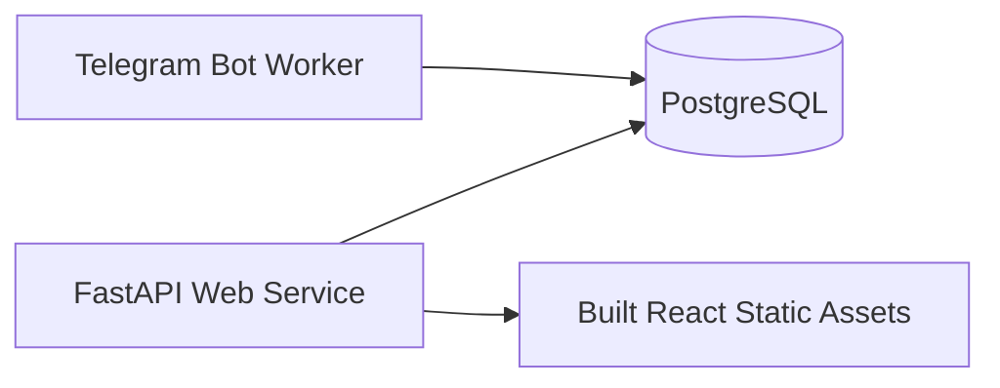
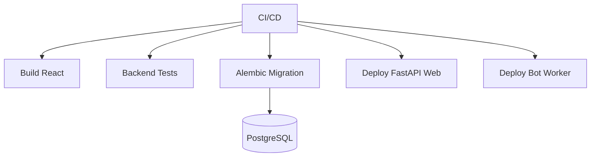

# Engineering Deployment

Audience: senior engineers.

Project: MSI LMS Portal.

## Current Implementation

Current deployment-related files:

- `Dockerfile`
- `Procfile`
- `railway.json`
- `scripts/railway_start.sh`
- `main.py`
- `backend/server.py`
- `frontend/package.json`

Current runtime modes:

- web only.
- bot only.
- both web and bot in one process for development or constrained deployments.

## Current Services



Recommended target:

- web and bot should be deployable as separate processes.
- both should use the same PostgreSQL database.
- frontend builds into backend static assets or deploys separately if architecture changes later.

## Required Environment Variables

Do not write actual values in docs.

Expected categories:

- database connection.
- app secret/session signing.
- bot token.
- Mini App URL.
- web host/port.
- admin preview feature flag.
- optional storage settings.
- optional Redis/rate-limit/cache settings.

Never commit:

- `.env`.
- tokens.
- database URLs.
- private keys.
- dumps.
- backups.

## Production Auth And Preview Flags

For real LMS usage:

```bash
ADMIN_PREVIEW_ROLES=0
```

Account/profile auth is always active. There is no legacy password-auth fallback
or account-auth feature flag.

`ADMIN_PREVIEW_ROLES` is a development/admin preview helper only. It should stay disabled in real usage so CEO, Academic Director, Customer Support, teacher, parent, and student sessions use their server-provided roles and cannot inherit stale browser preview state.

## Current Startup

Current entrypoint:

```bash
python3 main.py
```

Modes:

```bash
python3 main.py web
python3 main.py bot
```

Backend app import:

```bash
python3 - <<'PY'
from backend.server import app
print(app.name)
PY
```

## Frontend Build

Current frontend:

```bash
cd frontend
npm run check-types
npm run build
```

Generated assets should not be manually edited.

## Database Deployment

Schema changes should use Alembic.

Rules:

- no manual production schema edits unless approved.
- no destructive migrations without backup and rollback plan.
- migration reports for data changes.
- PostgreSQL remains source of truth.

## Target Deployment Model



## Deployment Checks

Before deploy:

- backend import check.
- Python compile check.
- frontend typecheck.
- frontend build.
- route guard tests.
- database migration dry-run where possible.
- no private files staged.

After deploy:

- health endpoint.
- login smoke checks.
- role workspace smoke checks.
- Telegram `/start` smoke check.
- parent invite smoke check in non-production or controlled test.

## Production Branch Rule

Production branch is `main`.

Rewrite/planning branch is `FastAPI-Run-System`.

Do not merge rewrite work to `main` until approved and verified.
