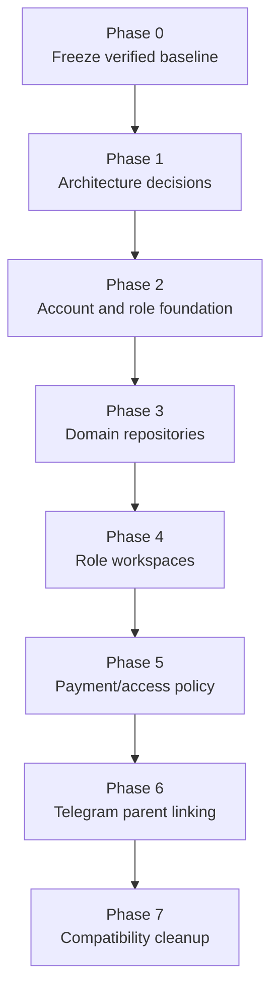

# Engineering Migration Plan

Audience: senior engineers.

Project: MSI LMS Portal.

## Current Migration Status

Excel academic statistics migration is complete and verified.

PostgreSQL schema `msi_v2` is now the working academic data source.

Excel and Google Sheets are import/export sources only.

Known issue:

- duplicate exam keys exist.
- do not clean yet.
- investigate later with a dedicated report.

## Migration Phase Diagram

## Phase 0: Freeze Verified Baseline

Actions:

- keep migration report.
- keep local backups ignored.
- record aggregate counts.
- protect current academic dashboard behavior.

Exit criteria:

- current dashboards load from PostgreSQL.
- validation queries remain clean except known duplicate exam keys.

## Phase 1: Architecture Decisions

Actions:

- final review of CEO docs.
- final review of engineering docs.
- senior engineer review.
- human decision on open questions.

Exit criteria:

- approved architecture decisions.
- implementation phases accepted.

## Phase 2: Account And Role Foundation

Actions:

- introduce target account abstraction.
- map current `admin` to `system_admin` transition.
- provision teacher login format `TCH0001`.
- preserve student MSI code login.
- keep parents Telegram-first.

Exit criteria:

- one user, one role.
- real LMS roles can route to correct workspace.

## Phase 3: Domain Repositories

Actions:

- move SQL ownership into repositories.
- keep domain services free of FastAPI request/session objects.
- expose explicit repository methods.
- remove route-level complex SQL over time.

Exit criteria:

- workspaces call domains.
- domains call repositories.
- bot and web no longer import each other.

## Phase 4: Role Workspaces

Priority:

1. CEO.
2. Academic Director.
3. Customer Support.
4. HR Manager.
5. Teacher.
6. Student.
7. Parent.
8. System Admin.

Exit criteria:

- no production dependency on admin preview modes.
- each workspace has explicit route guards.

## Phase 5: Payment And Access Policy

Actions:

- introduce invoices.
- introduce payment agreements.
- introduce payment warnings.
- introduce access policy decisions.
- introduce access restrictions.

Exit criteria:

- B2C support workflow exists.
- B2B escalation goes to CEO.
- route blocking uses policy service.

## Phase 6: Telegram Parent Linking

Actions:

- move linking rules to shared domain.
- bot and web call same service.
- audit invite/link/unlink.
- support children across schools.

Exit criteria:

- parent can see only linked children.
- invite lifecycle is auditable.

## Phase 7: Compatibility Cleanup

Actions:

- remove live spreadsheet runtime dependencies.
- remove duplicate permissions.
- remove plaintext password compatibility.
- remove direct bot/backend coupling.
- review legacy columns.

Exit criteria:

- tests pass.
- docs updated.
- no unapproved data deletion.

## Migration Safety

- No destructive SQL without exact approval.
- No private data in docs or logs.
- No backups committed.
- Use Alembic for schema changes.
- Produce migration reports for data changes.
