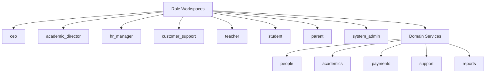

# Engineering Module Map

Audience: senior engineers.

Project: MSI LMS Portal.

## Current Implementation Module Map

```text
backend/
  server.py
  main.py
  routes/
  roles/
  domains/
  identity/
  security/
  utils/
  static/

database/
  database.py
  tables.py
  queries/
  cross_queries/
  academics/
  alembic/

frontend/src/
  app/
  roles/
  shared/

tgbot/
  handlers/
  keyboards/
  helpers.py

scripts/
```

## Current Backend Modules

### `backend/server.py`

Current implementation:

- FastAPI app creation.
- middleware.
- static files.
- route registration.
- session setup.

Target:

- Keep app composition thin.
- Move business decisions out of server wiring.

### `backend/roles`

Current implementation:

- role route folders exist.
- admin is mature but overloaded.
- CEO, HR, Customer Support, and Academic Director are mostly shell workspaces.

Target:

- each real role gets a real workspace.
- `system_admin` replaces current business use of admin.

### `backend/domains`

Current implementation:

- partial domains exist for academics, payments, resources, complaints, communication, office hours, announcements.

Target:

- domains own business rules and are reused by workspaces and integrations.

### `backend/identity`

Current implementation:

- credentials.
- roles.
- parent invites.
- Telegram links.
- student accounts.
- teacher helpers.

Target:

- one account/auth architecture.
- one role per user.
- `system_admin` separated from LMS business roles.

### `database`

Current implementation:

- PostgreSQL connection wrapper.
- Alembic.
- raw query modules.
- academic normalization helpers.

Target:

- repositories own SQL.
- domain services consume repositories.
- canonical helpers stay reusable.

### `frontend/src`

Current implementation:

- React bootstrap by backend payload.
- role-specific pages.
- shared UI primitives.
- admin panel is largest UI.

Target:

- real role workspaces.
- shared design system.
- avoid role preview as production mechanism.

### `tgbot`

Current implementation:

- `/start`.
- parent invite start parameter.
- quick summary.
- contact support.
- account link/unlink helpers.

Target:

- bot acts as integration adapter.
- no direct import from web backend modules.
- shared domain services own parent linking rules.

## Responsibility Leakage

Current leakage:

- admin owns business workflows that should belong to CEO, Academic Director, HR, Customer Support, and System Admin.
- payment access policy is not separated from payment records.
- parent linking exists in web and bot flows instead of one shared domain.
- permissions exist in more than one module.
- SQL appears in routes and services.
- README/project docs still describe a future folder layout that is not the actual layout.

## What To Keep

- PostgreSQL `msi_v2` academic data.
- Alembic setup.
- canonical school/subject/date/text helpers.
- parent invite concept.
- Telegram HMAC validation.
- shared React UI primitives.
- academic dashboard calculations where verified.

## What To Rewrite

- auth/account model.
- role workspaces.
- payment/access policy.
- parent linking ownership.
- teacher login provisioning.
- route guards and permissions.
- repository ownership.

## What To Delete Later

Delete only after replacement and verification:

- live spreadsheet runtime paths.
- admin preview mode as production role architecture.
- plaintext password compatibility.
- duplicate permission system.
- direct bot/backend coupling.
- dead compatibility shims.

## Target Module Ownership



## First Engineering Rule

Before adding a feature, identify:

- role workspace.
- domain owner.
- repository/query owner.
- frontend or Telegram surface.
- verification command.
