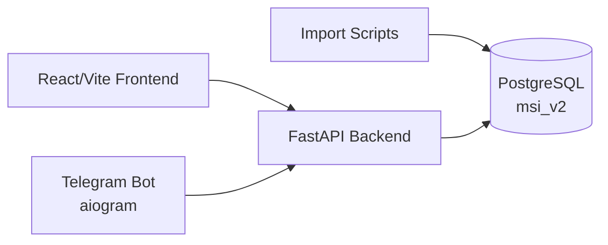
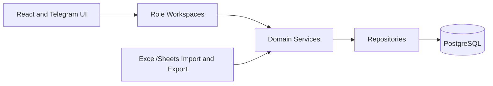

# Engineering Overview

Audience: senior engineers and implementation team.

Project: MSI LMS Portal.

Status: engineering planning documentation. This document distinguishes current implementation from target architecture.

## Current Implementation

Current branch: `FastAPI-Run-System`.

Production branch: `main`.

Current stack:

- Backend: FastAPI.
- Frontend: React/Vite.
- Telegram bot: aiogram.
- Database: PostgreSQL schema `msi_v2`.
- Imports: Excel import script for academic statistics.

Current source layout:

```text
backend/
frontend/
database/
tgbot/
scripts/
tests/
docs/
```

PostgreSQL is the source of truth. Excel and Google Sheets are import/export sources only.

## Current System Architecture



Current caveat:

- Some bot code imports backend identity modules directly.
- Admin routes currently mix several LMS business responsibilities.
- CEO, HR Manager, Customer Support, and Academic Director are not yet full production workspaces.

## Target Architecture

Target architecture is domain-first:



Target rules:

- Routes should be thin.
- Workspaces answer what a role can do.
- Domains own business rules.
- Repositories own SQL.
- PostgreSQL stores canonical state.
- Bot and web should not import each other.

## Confirmed Roles

Internal platform role:

- `system_admin`

Real LMS roles:

- `ceo`
- `hr_manager`
- `customer_support`
- `student`
- `teacher`
- `parent`
- `academic_director`

One user has exactly one role.

## Current Data Status

Academic Excel migration is complete and verified.

Migrated academic runtime tables:

- `lesson_sessions`
- `attendance_records`
- `homework_scores`
- `exam_results`

Known issue:

- Duplicate exam keys exist historically.
- Do not clean yet.
- Investigate later with a dedicated report.

## Target Engineering Priorities

1. Preserve verified PostgreSQL academic data.
2. Split `system_admin` from LMS business roles.
3. Build real role workspaces.
4. Normalize auth, sessions, and permissions.
5. Introduce payment invoices, warnings, agreements, and access restrictions.
6. Move parent Telegram linking into a shared domain service.
7. Remove live spreadsheet dependencies.
8. Keep future AI, Google Slides, and adaptive learning outside current implementation.

## Non-Goals For Current Rebuild

- AI module.
- Google Slides module.
- Adaptive learning module.
- Parent password login.
- Automatic B2B whole-school blocking.
- Duplicate exam cleanup.

## Verification Philosophy

Every phase should verify:

- database integrity.
- route guards.
- role access.
- frontend build.
- Telegram parent linking.
- no private data leakage in docs or logs.
