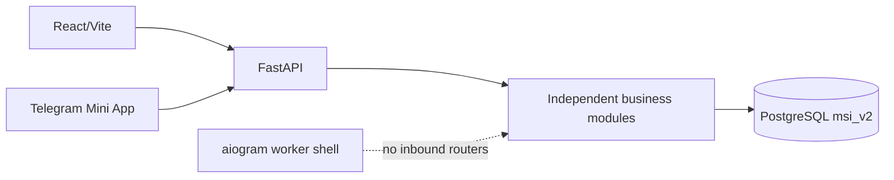

# Engineering Overview

Audience: engineers joining or reviewing the MSI LMS rewrite.

## Current System

MSI LMS is a PostgreSQL-first, multi-role web portal. FastAPI owns HTTP/security orchestration, React owns role UI, domain modules own business rules and SQL, and Alembic owns DDL.

PostgreSQL is the only LMS data source. Google Sheets and Excel are not integrations. Telegram authentication and Mini App linking remain, but the retired bot-handler/Sheets architecture does not.

## Implemented Architecture Decisions

- One canonical `accounts` row owns login, password hash, role, status, forced-change state, and session version.
- Role data lives in Student, Parent, or staff profiles; teachers remain staff records without portal access.
- Every password-enabled role can change its own password through one v1 endpoint.
- Initial login-equals-password credentials are blocked from workspaces until changed.
- Telegram links authenticate through the same canonical account.
- Parent invites are hash-only, expiring, single-use, and atomically consumed.
- `students.id` is the internal student identity; legacy/public IDs are compatibility boundaries only.
- Runtime SQL is module-owned; the old technical-layer trees are removed.
- Runtime DDL is removed; Alembic repository head is `0028_remove_system_admin`.
- APIs are versioned under `/api/v1`; old role API namespaces are gone.
- React uses server bootstrap payloads, role-owned pages, shared accessible UI, and explicit `Asia/Tashkent` time helpers.

## Current Roles

- `ceo`
- `hr_manager`
- `academic_director`
- `head_of_department`
- `customer_support`
- `student`
- `parent`
- `teacher`

The business roles own separate workspaces. Role checks do not replace object checks such as linked child, subject scope, chat membership, or canonical student ownership.

## Important Remaining Compatibility

- physical schema name `msi_v2`;
- selected legacy correlation and public dashboard ID columns;
- Telegram-first parent accounts without password credentials;
- an empty bot router registry until new inbound commands are product-approved and implemented.

## Release Boundary

Production branch `main` is reference-only during rewrite work. Validate migrations on a disposable clone, run backend/frontend verification, and use an explicitly approved merge/deploy process before production changes.
