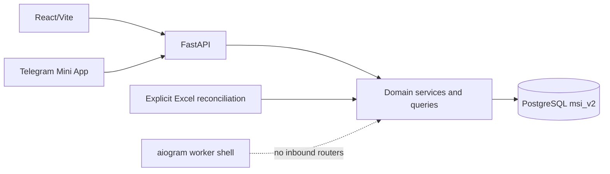

# Engineering Overview

Audience: engineers joining or reviewing the MSI LMS rewrite.

## Current System

MSI LMS is a PostgreSQL-first, multi-role web portal. FastAPI owns HTTP/security orchestration, React owns role UI, domain modules own business rules and SQL, and Alembic owns DDL.

Google Sheets is not a live runtime backend. Telegram authentication and Mini App linking remain, but the retired bot handlers and Google-Sheets-driven mini-app architecture do not.

## Implemented Architecture Decisions

- One canonical `accounts` row owns login, password hash, role, status, forced-change state, and session version.
- Role data lives in student, teacher, parent, or staff profiles.
- Every password-enabled role can change its own password through one v1 endpoint.
- Initial login-equals-password credentials are blocked from workspaces until changed.
- Telegram links authenticate through the same canonical account.
- Parent invites are hash-only, expiring, single-use, and atomically consumed.
- `students.id` is the internal student identity; legacy/public IDs are compatibility boundaries only.
- Runtime SQL is domain-owned; the old database query barrels are removed.
- Runtime DDL is removed; Alembic repository head is `0007_lms_integrity`.
- APIs are versioned under `/api/v1`; old role API namespaces are gone.
- React uses server bootstrap payloads, role-owned pages, shared accessible UI, and explicit `Asia/Tashkent` time helpers.

## Current Roles

- `system_admin`
- `ceo`
- `academic_director`
- `head_of_department`
- `hr_manager`
- `customer_support`
- `teacher`
- `student`
- `parent`

One account has one canonical role. Role checks do not replace object checks such as linked child, assigned group, subject scope, chat membership, or canonical student ownership.

## Important Remaining Compatibility

- physical schema name `msi_v2`;
- selected legacy correlation and public dashboard ID columns;
- remaining `/admin/*` HTML form actions and workspace helper services;
- `admin` presentation/session compatibility for `system_admin`;
- Telegram-first parent accounts without password credentials;
- an empty bot router registry until new inbound commands are product-approved and implemented.

## Data Reconciliation Position

The repository contains an explicit workbook reconciler for School 5 and Sehriyo source files. Documentation does not claim exact workbook/database parity. Only a completed, reviewed reconciliation report with resolved identities, dates, scores, and coin differences can support that claim.

Never invent lesson times or silently merge ambiguous people to make a report pass.

## Release Boundary

Production branch `main` is reference-only during rewrite work. Validate migrations on a disposable clone, run backend/frontend verification, and use an explicitly approved merge/deploy process before production changes.
