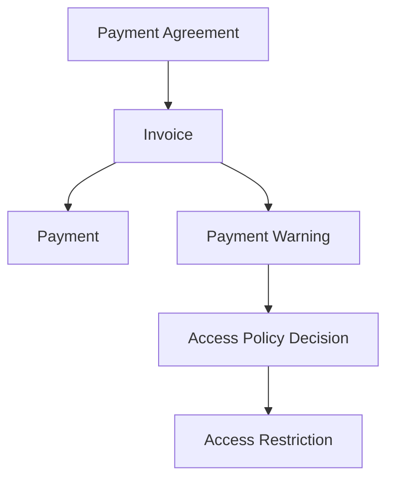
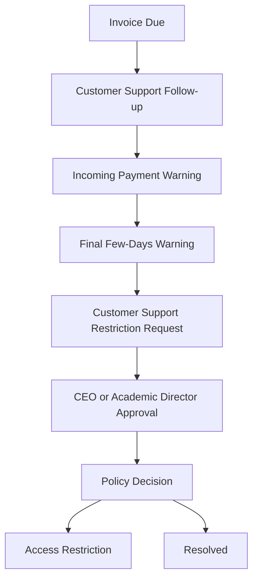
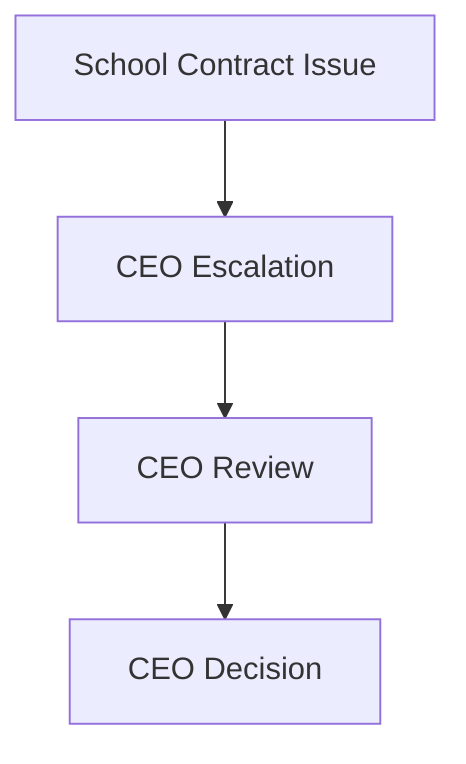

# Engineering Payment Access Policy

Audience: senior engineers.

Project: MSI LMS Portal.

## Current Implementation

Current payment code exists under:

- `backend/domains/payments/service.py`
- `database/queries/payment_queries.py`
- `backend/roles/admin/routes/payment_routes.py`

Current database table:

- `payments`

Current status:

- no production payment rows were present during verification.
- payment schema and service should be corrected before real payment data grows.

## Target Decisions

- Use invoices, warnings, agreements, and access restrictions.
- Do not hardcode blocking directly in routes.
- Customer Support handles B2C parent/student payment support.
- B2B unpaid school contract issues escalate to CEO only.
- Do not automatically block a whole school.

## Target Payment Model



## Proposed Tables

- `payment_agreements`
- `invoices`
- `invoice_items`
- `payments`
- `payment_warnings`
- `access_policies`
- `access_policy_decisions`
- `access_restrictions`
- `school_contracts`
- `school_contract_events`

## B2C Flow

B2C covers parent/student payment support.



Customer Support can:

- view parent/student payment state.
- create warnings.
- record follow-up.
- record parent responses.
- handle support tickets.
- request B2C access restrictions from CEO or Academic Director.
- continue B2C work after restriction approval is granted.

Restriction approval rule:

- Customer Support cannot approve B2C access restrictions directly.
- CEO or Academic Director approves the restriction.
- After approval, Customer Support can execute the B2C follow-up workflow.

Warning sequence:

1. Incoming payment warning.
2. Final warning that only a few days remain before restriction.
3. Restriction until payment is completed.

## B2B Flow

B2B covers school contracts.



Rules:

- Customer Support does not independently enforce B2B contract restrictions.
- Do not automatically block all students in a school.
- Any student-level restriction from a B2B issue must come from CEO-approved policy.

## Access Policy API

Target service shape:

```text
decision = access_policy.can(account, action, object)
```

Decision result:

- `allowed`.
- `reason_code`.
- `message_key`.
- `restriction_id`, if applicable.
- `audit_context`.

Routes must use this service instead of checking invoices directly.

## Actions To Evaluate

Possible actions:

- `class.enter`
- `dashboard.view`
- `homework.submit`
- `office_hours.book`
- `chat.use`
- `parent_portal.view`

## Audit Requirements

Audit:

- invoice created/updated/cancelled.
- payment recorded.
- warning created.
- warning status changed.
- access restriction created/activated/removed.
- CEO B2B decision.

## Current Technical Risk

Current payment query/service behavior should be reviewed before implementation because the meaning of student identifiers must be consistent:

- internal `students.id`.
- public legacy student row id.
- public dashboard/enrollment id.

Target code must use explicit names and avoid ambiguous `student_id`.
