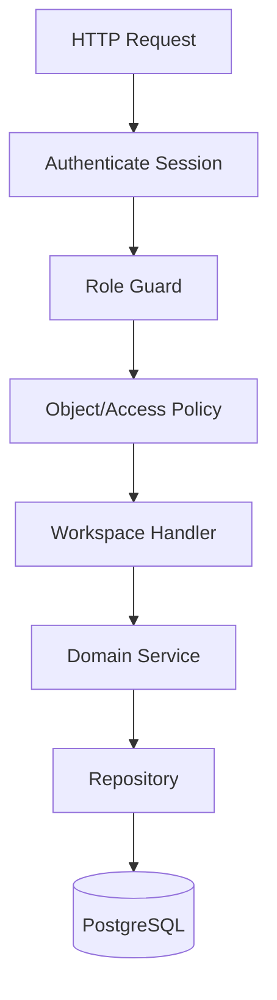

# Engineering Route Map

Audience: senior engineers.

Project: MSI LMS Portal.

## Current Implementation

Routes are registered from FastAPI modules under `backend/`.

Important note:

- Some current route ownership is transitional.
- Current `admin` route paths are not the final role architecture.
- Do not expose private row-level data when testing routes.

## Current Public/System Routes

| Method | Path | Purpose |
|---|---|---|
| GET | `/` | home/login redirect based on session |
| POST | `/login` | credential login |
| POST | `/logout` | logout |
| POST | `/auth/telegram` | Telegram Mini App auth |
| GET | `/unauthorized` | unauthorized page |
| GET | `/manifest.webmanifest` | PWA manifest |
| GET | `/sw.js` | service worker |
| GET | `/api/v1/system/status` | system status |
| GET | `/api/v1/auth/me` | current user metadata |

## Current Student Routes

| Method | Path | Purpose |
|---|---|---|
| GET | `/student` | student entry |
| POST | `/profile/password` | student password change |
| POST | `/search` | student dashboard search |
| GET | `/api/metadata` | student metadata |
| GET | `/api/students/search` | student search |
| GET | `/api/activity/ping` | student activity heartbeat |
| GET | `/dashboard/{student_id}` | dashboard |
| GET | `/dashboard/{student_id}/resources` | resources |
| GET | `/dashboard/{student_id}/chat` | chat page |
| GET | `/dashboard/{student_id}/rating-board` | rating |
| GET | `/dashboard/{student_id}/aap-lessons` | AAP |
| GET | `/dashboard/{student_id}/ar-lessons` | AR |
| GET | `/dashboard/{student_id}/office-hours` | office hours |
| GET | `/api/students/{student_id}/dashboard` | dashboard API |
| GET/POST/PUT/DELETE | `/api/chat/messages` | student chat APIs |
| GET/POST | `/api/resources/{resource_id}/comments` | resource comments |
| GET/POST/PATCH | `/api/office-hours/*` | student office hours |

Current caveat:

- Some `{student_id}` route params represent public dashboard/enrollment ids, not internal database row ids.

## Current Parent Routes

| Method | Path | Purpose |
|---|---|---|
| GET | `/parent` | parent home |
| GET | `/parent/invite/{code}` | invite code landing |
| GET | `/parent/link/{token}` | signed token landing |
| POST | `/parent/link/{token}` | parent link submit |
| GET | `/parent/dashboard/{student_row_id}` | linked child dashboard redirect |

## Current Teacher Routes

| Method | Path | Purpose |
|---|---|---|
| GET | `/teacher` | teacher home |
| GET/POST | `/teacher/api/office-hours/availability` | availability |
| PATCH | `/teacher/api/office-hours/availability/{availability_id}` | cancel availability |
| GET | `/teacher/api/office-hours/bookings` | bookings |
| PATCH | `/teacher/api/office-hours/bookings/{booking_id}` | booking status |

## Current Business Role Shell Routes

| Method | Path | Purpose |
|---|---|---|
| GET | `/ceo` | CEO shell |
| GET | `/hr` | HR shell |
| GET | `/hr-manager` | HR alias |
| GET | `/support` | Customer Support shell |
| GET | `/customer-support` | Customer Support alias |
| GET | `/academic-director` | Academic Director shell |
| GET | `/academic_director` | Academic Director alias |

## Current Admin/Management Routes

Current admin routes include:

- `/admin`.
- `/admin/continue`.
- `/admin/api/students`.
- `/admin/api/students/{student_row_id}/parent-invite`.
- `/admin/students/{student_row_id}`.
- `/admin/students/{student_row_id}/dashboard`.
- `/admin/api/students/{student_row_id}/payments`.
- `/admin/api/student-payments/{payment_id}`.
- `/admin/academic/*`.
- `/admin/api/academic/*`.
- `/admin/api/announcements`.
- `/admin/api/complaints`.
- `/admin/api/chat/*`.
- `/admin/api/resources`.
- `/admin/resources/*`.
- `/admin/api/office-hours/*`.
- `/admin/teachers/*`.
- `/admin/teacher-candidates/*`.
- `/admin/parents/*`.
- Teacher Academy mutations are owned by Academic Director and HOD role APIs;
  admin/system admin keeps read-only page compatibility where needed.

Target:

- split these by role workspace and domain ownership.
- keep compatibility redirects only while required.

## Target Route Structure

Proposed:

```text
/api/v1/auth/*
/api/v1/system/*
/api/v1/ceo/*
/api/v1/academic-director/*
/api/v1/hr/*
/api/v1/support/*
/api/v1/teacher/*
/api/v1/student/*
/api/v1/parent/*
/api/v1/system-admin/*
```

Workspace pages can remain separate from APIs:

```text
/ceo
/academic-director
/hr
/support
/teacher
/student
/parent
/system-admin
```

## Route Guard Rules

- Authenticate first.
- Normalize role.
- Enforce workspace role.
- Enforce object policy.
- Audit sensitive drilldown.
- Never make payment/access decisions directly inside route functions.

## Target Route Flow


