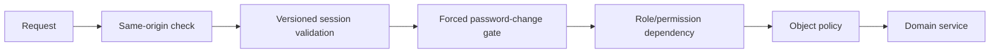

# Engineering Route Map

Audience: engineers changing HTTP contracts or authorization.

The checked-in canonical inventory is `tests/route_snapshot.txt`. This document groups the routes by responsibility; it is not a replacement for the snapshot.

## Public and Identity Routes

| Method | Path | Purpose |
| --- | --- | --- |
| `GET` | `/` | login or role-aware home redirect |
| `POST` | `/login` | canonical account password login |
| `POST` | `/logout` | clear session |
| `POST` | `/auth/telegram` | HMAC-verified Telegram Mini App sign-in/start-param claim |
| `GET` | `/account/security` | forced or voluntary password-change page |
| `GET` | `/api/v1/auth/me` | canonical account, role, and permissions |
| `PATCH` | `/api/v1/auth/password` | self-service canonical password change |
| `GET` | `/api/v1/system/status` | system status |
| `GET|POST` | `/parent/invite/{code}` | expiring, hash-backed parent invite claim |

`/parent/invite/{code}` is public so a logged-out parent can claim it. The code is still checked against a pending, unexpired digest and consumed transactionally. The former `/parent/link/{token}` routes no longer exist.

## Role Pages

| Role | Primary page paths |
| --- | --- |
| student | `/student`, `/dashboard/{public_id}` and dashboard subpages |
| parent | `/parent`, `/parent/dashboard/{student_row_id}` |
| teacher | `/teacher` |
| Academic Director | `/academic-director` and academic subpages |
| HOD | `/head-of-department` and scoped subpages |
| CEO | `/ceo` |
| HR Manager | `/hr`, `/hr-manager` |
| Customer Support | `/support`, `/customer-support` |
| System Admin | `/admin` and remaining admin form/page routes |

Student dashboard route values are public enrollment/dashboard IDs. Parent `student_row_id` paths are compatibility contracts. Neither is the canonical authorization identity; services resolve them to `students.id`.

## API v1 Families

### Academic Director

- `/api/v1/academic-director/academic/*`
- `/api/v1/academic-director/head-of-departments`
- `/api/v1/academic-director/teacher-academy/*`

Academic enrollment group moves are constrained to the same school and subject program. HOD management and Teacher Academy actions are role guarded.

### Head of Department

- `/api/v1/head-of-department/teacher-academy/*`

These routes require explicit assigned-subject scope in addition to the HOD role.

### System/Admin Operations

- `/api/v1/admin/academic/*`
- `/api/v1/admin/announcements/*`
- `/api/v1/admin/chat/*`
- `/api/v1/admin/complaints/*`
- `/api/v1/admin/office-hours/*`
- `/api/v1/admin/parents/*` and `/parent-children/*`
- `/api/v1/admin/resources/*`
- `/api/v1/admin/students/*`
- `/api/v1/admin/student-payments/*`

Some older HTML form actions remain under `/admin/*` for students, teachers, candidates, academic setup, and resources. They are protected by the same middleware and must migrate slice-by-slice without creating another JSON namespace.

### Teacher

- `/api/v1/teacher/office-hours/availability`
- `/api/v1/teacher/office-hours/availability/{availability_id}`
- `/api/v1/teacher/office-hours/bookings`
- `/api/v1/teacher/office-hours/bookings/{booking_id}`

Teacher identity, assigned subject, future time, slot interval, overlap, duration, and capacity are checked server-side.

### Student

- `/api/v1/student/activity/ping`
- `/api/v1/student/chat/messages*`
- `/api/v1/student/resources/{resource_id}/comments`
- `/api/v1/student/office-hours/availability`
- `/api/v1/student/office-hours/bookings*`

The backend takes student identity from the canonical session, not a caller-supplied student ID. Chat room membership and booking ownership are object policies.

## Removed Namespaces

Do not add routes under:

```text
/admin/api
/teacher/api
/student/api
/academic-director/api
/head-of-department/api
/api/* without /v1
```

## Guard Order



Public signed/HMAC flows have narrowly defined middleware exceptions. An exception to same-origin checks is not an exception to payload verification.

## Route Change Checklist

- Add or update FastAPI schemas.
- Use canonical account/student identifiers internally.
- Enforce role and object policy on the server.
- Use a domain service and domain query owner.
- Update `frontend/src/shared/api/routes.ts` where applicable.
- Update `tests/route_snapshot.txt` intentionally.
- Add authorization and error-contract tests.
- Do not create runtime DDL or import a deleted compatibility facade.
