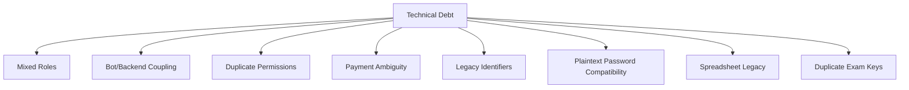

# Engineering Technical Debt

Audience: senior engineers.

Project: MSI LMS Portal.

## Purpose

This document lists known technical debt and risks that should be addressed during the rebuild.

## Current High-Priority Debt

### Mixed Admin Responsibility

Current `admin` code handles:

- internal operations.
- students.
- parents.
- teachers.
- payments.
- academic structure.
- resources.
- support.
- role previews.

Target:

- `system_admin` for internal operations.
- real LMS role workspaces for business users.

### Bot And Backend Coupling

Current bot imports backend identity modules.

Risk:

- bot and web cannot evolve independently.

Target:

- bot calls integration adapters.
- shared domain services own parent linking and account logic.

### Duplicate Permission Systems

Current code has permissions in more than one place.

Risk:

- route behavior can diverge.

Target:

- one role/permission/policy layer.

### Payment Model Ambiguity

Current payment code exists but payment data is not yet populated.

Risk:

- identifier confusion before real payment data grows.

Target:

- invoices, agreements, payments, warnings, access restrictions.
- explicit identifier names.

### Legacy Identifier Names

Some current routes use names like `student_id` for public dashboard/enrollment ids.

Risk:

- bugs from confusing internal database ids with public ids.

Target:

- use explicit names:
  - `student_code`
  - `student_row_id`
  - `enrollment_id`
  - `dashboard_student_id`

### Plaintext Password Compatibility

Current compatibility fields include plaintext password storage.

Risk:

- security exposure.

Target:

- password hashes only.
- no plaintext password storage.

### Live Spreadsheet Legacy

Excel/Google Sheets used to be operational sources.

Risk:

- accidental reintroduction of live spreadsheet dependency.

Target:

- import/export only.
- PostgreSQL runtime only.

### Duplicate Exam Keys

Known historical duplicate exam keys exist.

Decision:

- do not clean yet.
- investigate later with report.

## Medium-Priority Debt

- admin UI is large and should be split by workspace/domain.
- route functions should become thinner.
- SQL should move fully into repositories.
- frontend should get a formal design system.
- CEO/HR/Support/Academic Director pages need real implementations.
- import scripts should live under an import integration area.
- docs still need final senior engineer review.

## Future Module Risk

Future modules:

- AI.
- Google Slides.
- adaptive learning.

Risk:

- adding these before core architecture is stable will increase complexity.

Policy:

- defer future modules until core LMS rebuild is stable.

## Technical Debt Map

## Cleanup Rules

- Do not delete data without explicit approval.
- Do not clean duplicate exams without a report.
- Do not remove compatibility until replacement is verified.
- Do not rename all identifiers in one bulk change.
- Prefer phase-by-phase migration.

## Senior Engineer Review Focus

Senior review should focus on:

- account model.
- role and permission design.
- payment/access policy.
- parent Telegram linking boundary.
- database migration safety.
- workspace/domain boundaries.
- deployment split between web and bot.
