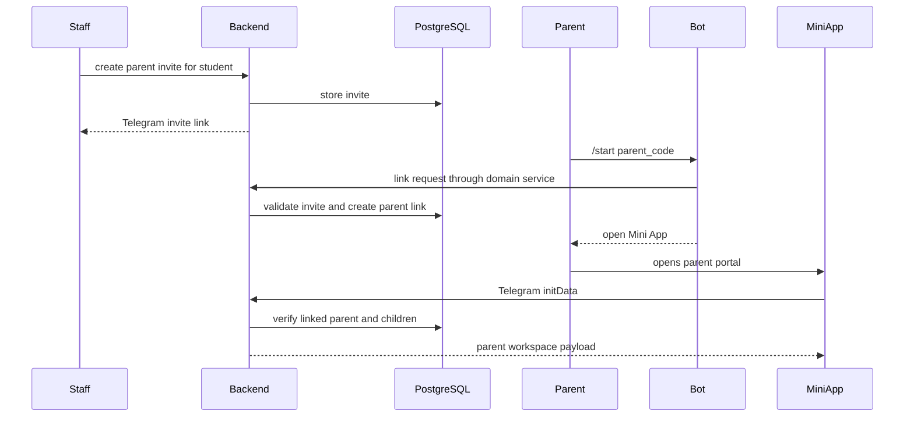
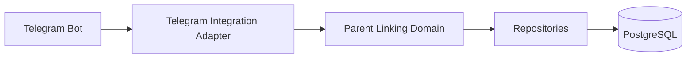

# Engineering Telegram Flow

Audience: senior engineers.

Project: MSI LMS Portal.

## Current Implementation

Telegram bot:

- aiogram.
- handlers in `tgbot/handlers`.
- keyboards in `tgbot/keyboards`.

Current parent linking:

- admin route creates invite token and code.
- bot handles `/start parent_{code}`.
- Mini App validates invite and Telegram initData.
- parent is linked to student.
- parent can access linked children.

Current issue:

- bot imports backend identity modules directly.
- target should move parent linking into a shared domain service.

## Parent Telegram Linking Flow

## Target Service Ownership

Parent linking domain should own:

- invite creation.
- invite validation.
- Telegram identity verification result handling.
- parent creation/update.
- parent-child link creation.
- audit events.

Bot should own:

- Telegram command parsing.
- Telegram messages.
- keyboard buttons.

Web should own:

- session creation.
- rendering parent invite/portal pages.
- calling parent linking domain.

## Target Data Tables

- `parents`.
- `parent_student_links`.
- `account_invites`.
- `telegram_accounts`.
- `account_telegram_links`.
- `audit_events`.

## Security Rules

- Never trust raw Telegram user id from client input.
- Verify Telegram Mini App initData.
- Signed invite token is not identity proof by itself.
- Parent access requires active parent-child link.
- Link/unlink actions must be audited.

## Parent Cross-School Rule

Parent portal must support children across:

- School 5.
- Sehriyo.
- future schools.

Do not assume one parent belongs to one school.

## Bot Command Scope

Current/future bot flows:

- `/start`.
- `/start parent_{code}`.
- `/whoami`.
- `/unlink_me`.
- quick summary.
- contact support.

Bot must not own payment policy or academic rules.

## Target Integration Boundary

## Open Decisions

- Should manual fallback remain in v1?
- How should expired/revoked invite UX look in Telegram?

## Confirmed Parent Invite Roles

Parent invite links can be generated by:

- CEO.
- Academic Director.
- Customer Support.
