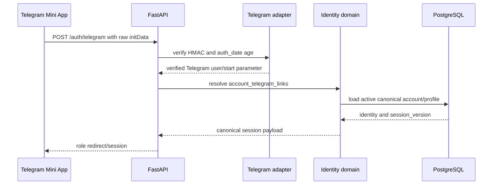
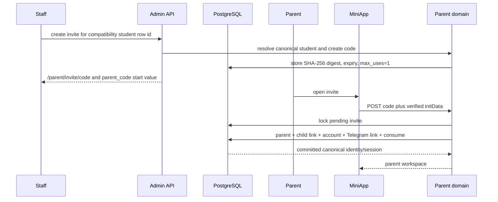

# Engineering Telegram Integration

Audience: engineers working on Mini App authentication, parent linking, notifications, or the bot worker.

## Current State

Telegram remains an integration surface for the LMS web application:

- `/auth/telegram` validates Mini App `initData` and creates a canonical account session;
- the React bootstrap reads a `parent_{code}` start parameter and opens `/parent/invite/{code}` once per Mini App session;
- the parent invite page can submit verified Mini App identity;
- Teacher Academy can send best-effort outbound notifications.

The old inbound bot implementation is retired. `tgbot/routing.py` intentionally defines `BOT_ROUTERS = ()`; `main.py bot` can start the dispatcher, but no `/start`, callback, account-link, or support command handlers are currently registered. Do not document those commands as implemented.

## Mini App Authentication

Security rules:

- trust only the raw `window.Telegram.WebApp.initData` after server-side HMAC verification;
- enforce `WEBAPP_INIT_DATA_TTL` replay protection unless a reviewed test explicitly overrides it;
- never trust `initDataUnsafe`, a Telegram ID query parameter, or a username;
- resolve Telegram identity through `account_telegram_links` to the same canonical account/profile used by password auth;
- apply account status, profile status, role, and session-version rules after Telegram verification.

## Parent Invite Flow

The raw invite code is a user-held capability and is never persisted. Lookup uses its SHA-256 digest. Claim validates status/expiry, locks the invite row, and consumes it in the same transaction as parent linking and canonical-account provisioning.

The manual fallback form uses the same invite transaction but has no Telegram identity to link. It creates a Telegram-first canonical parent account without a password credential and issues a versioned web session.

The deleted `/parent/link/{token}` signed-token flow must not be restored.

## Ownership Boundary

| Layer | Owns |
| --- | --- |
| `backend/integrations/telegram` | HMAC parsing and Telegram protocol details |
| `backend/domains/identity` | Telegram-link to canonical-account authentication |
| `backend/domains/parents` | invite creation/claim, parent-child linking, transaction |
| `backend/pages/parent.py` | parent invite/page UX |
| `frontend/src/shared/lib/telegram.ts` | Mini App viewport/start-param client adapter |
| `tgbot` | future inbound commands/messages/keyboards only |

Bot handlers must call domain services through an adapter. They must not duplicate invite, account, academic, payment, or authorization rules.

## Outbound Teacher Academy Notifications

Outbound notifications are independent of inbound bot routers. They use `BOT_TOKEN` and optionally:

- `TEACHER_ACADEMY_CHANNEL_CHAT_ID`
- `TEACHER_ACADEMY_<SUBJECT>_CHAT_ID`

A Telegram username is display metadata; the Bot API cannot initiate a private chat from a username alone. Direct messages require a known numeric Telegram user ID. Welcome messages must not leak assigned lesson names, schedules, or lesson counts into channels.

## Before Adding Inbound Bot Handlers

- define the exact command/product scope;
- keep `tgbot/routing.py` as the explicit registry;
- use Telegram adapters plus existing domain services;
- test HMAC/start-parameter and replay behavior independently of real users;
- enforce the same canonical account and object policies as the web app;
- add deployment and smoke coverage before describing the bot as active.
