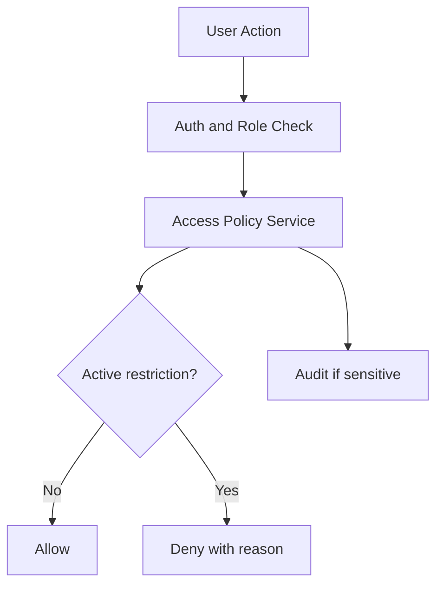

# Engineering Testing

Audience: senior engineers.

Project: MSI LMS Portal.

## Testing Goals

Testing must protect:

- migrated PostgreSQL academic data behavior.
- auth and role routing.
- parent Telegram linking.
- payment/access policy.
- role workspace permissions.
- frontend rendering.
- no private data leakage.

## Current Test Areas

Existing tests include coverage for:

- student dashboard service.
- teacher accounts.
- ratings.
- auth gates.
- pages/rendering.
- role routing.
- teacher academy.
- request context.
- route snapshots.

## Backend Checks

Compile/import:

```bash
python3 -m compileall -q backend database tgbot scripts main.py
python3 - <<'PY'
from backend.server import app
print(app.name)
PY
```

Tests:

```bash
pytest
```

Use targeted tests while working, then broader tests before handoff.

## Frontend Checks

```bash
cd frontend
npm run check-types
npm run build
```

If UI is changed, verify:

- desktop layout.
- mobile layout.
- Telegram Mini App safe-area behavior.
- no text overlap.
- no broken role page bootstraps.

## Database Validation

Validation categories:

- orphan attendance records.
- orphan homework records.
- orphan exam records.
- lesson sessions without group/subject.
- duplicate attendance keys.
- duplicate homework keys.
- duplicate exam keys.
- counts by school.
- counts by subject.
- counts by source import.

Known:

- duplicate exam keys exist and should be investigated later, not silently cleaned.

## Auth And Role Tests

Test:

- unauthenticated users cannot access workspaces.
- each role lands in correct workspace.
- parent sees only linked children.
- teacher sees only assigned groups.
- customer support cannot change academic structure by default.
- CEO drilldown creates audit event where required.
- `system_admin` is not treated as normal LMS business role.

## Payment/Access Policy Tests

Test:

- invoice state calculation.
- warning creation.
- B2C follow-up workflow.
- B2B CEO escalation.
- access restriction activation/removal.
- route checks consult policy service.
- no route hardcodes unpaid blocking.

Payment/access decision flow:



## Telegram Tests

Test:

- `/start`.
- `/start parent_{code}`.
- parent invite validation.
- Telegram initData validation.
- parent-child link creation.
- parent child access.
- `/whoami`.
- unlink behavior.

Never use real parent/student private data in test docs.

## Documentation Privacy Test

Before publishing docs, scan for:

- database URLs.
- tokens.
- `.env` values.
- student names.
- parent phone numbers.
- Telegram IDs.
- raw grades.
- row-level data.

Docs should contain only sanitized architecture, aggregate counts, and generic examples.

## CI Target

Longer-term CI should run:

- Python compile.
- backend tests.
- frontend typecheck.
- frontend build.
- route snapshot.
- migration lint/dry-run.
- private data pattern scan for docs.
