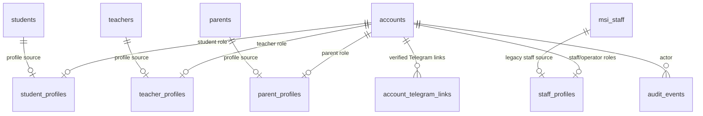

# Phase 1 Accounts Implementation Plan

Project: MSI LMS Portal.

Status: planning only. Do not treat this document as implemented code.

Branch context:

- Production branch: `main`.
- Planning/rewrite branch: `FastAPI-Run-System`.
- PostgreSQL schema: `msi_v2`.
- PostgreSQL is the source of truth.
- Existing Excel academic data has already been migrated into PostgreSQL.

Safety rules:

- Do not drop, truncate, or delete existing tables.
- Do not rewrite application code until Phase 1 implementation is explicitly approved.
- Create new tables and compatibility logic additively.
- Keep legacy auth available until cutover is verified.
- Do not expose passwords, Telegram IDs, names, phone numbers, raw grades, or row-level private data in reports.

## 1. Current Identity/Auth Tables And Fields

### Current Auth Shape

Current login/auth is split across separate concepts:

- staff/admin/teacher credential rows in `msi_v2.msi_staff`.
- student credential rows in `msi_v2.student_auth`.
- parent client rows in `msi_v2.parents`, Telegram-first.
- Telegram links stored directly on several profile tables.
- Starlette signed cookie session stores role-specific identifiers.

Current role naming still uses `admin` and `owner` in code. Target documentation uses `system_admin`.

### `msi_staff`

Purpose today: staff/operator credentials, teacher credentials, and legacy admin role storage.

Current columns:

| Column | Type | Nullable | Current notes |
|---|---:|---:|---|
| `id` | `bigint` | no | Primary key. |
| `login` | `text` | no | Case-insensitive unique index on `lower(login)`. |
| `password_hash` | `text` | no | Used for staff/admin/teacher password login. |
| `display_name` | `text` | no | Defaults to empty string. |
| `phone` | `text` | no | Defaults to empty string. |
| `telegram_user_id` | `bigint` | yes | Partial unique index when not null. |
| `telegram_username` | `text` | no | Defaults to empty string. |
| `role` | `text` | no | Current values include `owner` and `teacher` in local aggregate validation. |
| `status` | `text` | no | Defaults to `active`; disabled staff are blocked by current credential lookup. |
| `subject_scope` | `text` | no | Defaults to empty string. |
| `school_scope` | `text` | no | Defaults to empty string. |
| `legacy_admin_id` | `bigint` | yes | Partial unique index when not null. |
| `created_by_staff_id` | `bigint` | yes | FK to `msi_staff(id)`. |
| `created_at` | `timestamptz` | no | Defaults to `now()`. |
| `updated_at` | `timestamptz` | no | Defaults to `now()`. |
| `last_login_at` | `timestamptz` | yes | Not consistently updated by current auth. |
| `teacher_id` | `bigint` | yes | FK to `teachers(id)`; used for teacher account linkage. |

Current indexes:

- `idx_msi_staff_login_ci` unique on `lower(login)`.
- `idx_msi_staff_telegram_user_id` unique on `telegram_user_id` where not null.
- `idx_msi_staff_legacy_admin_id` unique on `legacy_admin_id` where not null.

Current code:

- `database/queries/admin_queries.py`
- `database/queries/teacher_queries.py`
- `backend/identity/credentials.py`
- `backend/identity/storage.py`
- `backend/utils/session.py`

### `students`

Purpose today: student profile and migrated academic identity.

Current columns:

| Column | Type | Nullable | Current notes |
|---|---:|---:|---|
| `id` | `bigint` | no | Primary key. |
| `student_code` | `text` | no | Globally unique by `upper(student_code)`. |
| `full_name` | `text` | no | Student display/profile name. |
| `school_id` | `bigint` | yes | FK to `schools(id)`. |
| `telegram_user_id` | `bigint` | yes | Partial unique index when not null; current direct student Telegram link field. |
| `photo_url` | `text` | no | Defaults to empty string. |
| `profile_description` | `text` | no | Defaults to empty string. |
| `status` | `text` | no | Defaults to `active`. |
| `legacy_public_dashboard_id` | `bigint` | yes | Legacy dashboard compatibility. |
| `legacy_student_row_id` | `bigint` | yes | External legacy student row id used by sessions/admin UI. |
| `created_at` | `timestamptz` | no | Defaults to `now()`. |
| `updated_at` | `timestamptz` | no | Defaults to `now()`. |
| `password_plain` | `text` | no | Legacy/admin display risk. Do not copy into new accounts. |
| `class_name` | `text` | no | Defaults to empty string. |
| `teacher_name` | `text` | no | Defaults to empty string. |
| `last_seen_at` | `timestamptz` | yes | Student activity tracking. |

Current indexes:

- `idx_students_code_ci` unique on `upper(student_code)`.
- `idx_students_telegram_user_id` unique on `telegram_user_id` where not null.
- `idx_students_legacy_student_row_id` unique on `legacy_student_row_id` where not null.

Current code:

- `database/cross_queries/student_queries.py`
- `backend/identity/student_accounts.py`
- `backend/identity/passwords.py`
- `backend/domains/identity/routes.py`
- student dashboard routes/services.

### `student_auth`

Purpose today: student password hash.

Current columns:

| Column | Type | Nullable | Current notes |
|---|---:|---:|---|
| `student_id` | `bigint` | no | PK and FK to `students(id)`. |
| `password_hash` | `text` | no | Used by student login. |
| `must_change_password` | `boolean` | no | Defaults to `true`. |
| `updated_at` | `timestamptz` | no | Defaults to `now()`. |
| `last_login_at` | `timestamptz` | yes | Available but not consistently updated. |

Current code:

- `verify_student_credentials()` joins `students` to `student_auth`.
- `update_student_password()` writes both `students.password_plain` and `student_auth.password_hash`.

### `teachers`

Purpose today: teacher profile and academic assignment identity.

Current columns:

| Column | Type | Nullable | Current notes |
|---|---:|---:|---|
| `id` | `bigint` | no | Primary key. |
| `full_name` | `text` | no | Teacher display/profile name. |
| `phone` | `text` | no | Defaults to empty string. |
| `telegram_user_id` | `bigint` | yes | Direct teacher Telegram field, but login currently uses `msi_staff`. |
| `telegram_username` | `text` | no | Defaults to empty string. |
| `status` | `text` | no | Defaults to `active`. |
| `notes` | `text` | no | Defaults to empty string. |
| `legacy_teacher_id` | `bigint` | yes | Legacy reference. |
| `created_at` | `timestamptz` | no | Defaults to `now()`. |
| `updated_at` | `timestamptz` | no | Defaults to `now()`. |

Related current teacher tables:

- `teacher_subjects`
- `group_teachers`
- `academy_teachers`

Current teacher auth:

- Teacher credential rows live in `msi_staff` with `role = 'teacher'`.
- `msi_staff.teacher_id` links to `teachers.id`.
- Current code accepts `TCH...` and old subject-prefix teacher logins.
- Target teacher login format is `TCH0001`, `TCH0002`, etc.

### `parents`

Purpose today: parent client profile, Telegram-first.

Current columns:

| Column | Type | Nullable | Current notes |
|---|---:|---:|---|
| `id` | `bigint` | no | Primary key. |
| `display_name` | `text` | no | Defaults to empty string. |
| `phone` | `text` | no | Defaults to empty string. |
| `telegram_user_id` | `bigint` | yes | Partial unique index when not null. |
| `telegram_username` | `text` | no | Defaults to empty string. |
| `preferred_language` | `text` | no | Defaults to `ru`. |
| `status` | `text` | no | Defaults to `active`. |
| `legacy_parent_id` | `bigint` | yes | Partial unique index when not null. |
| `legacy_admin_id` | `bigint` | yes | Partial unique index when not null. |
| `created_at` | `timestamptz` | no | Defaults to `now()`. |
| `updated_at` | `timestamptz` | no | Defaults to `now()`. |

Current code:

- `backend/identity/parent_accounts.py`
- `database/queries/parent_account_queries.py`
- `backend/roles/parent/routes.py`
- `backend/domains/identity/routes.py`
- Telegram bot `/start` invite flow.

### `parent_student_links`

Purpose today: parent-child many-to-many relationship.

Current columns:

| Column | Type | Nullable | Current notes |
|---|---:|---:|---|
| `parent_id` | `bigint` | no | FK to `parents(id)`. |
| `student_id` | `bigint` | no | FK to `students(id)`. |
| `relationship` | `text` | no | Defaults to `parent`. |
| `status` | `text` | no | Defaults to `active`. |
| `created_at` | `timestamptz` | no | Defaults to `now()`. |

Current primary key:

- `(parent_id, student_id)`.

Target:

- Keep this table as the parent-child domain table.
- Do not move child links into account rows.

### Telegram Link Fields

Current Telegram identity/link fields are spread across several tables:

| Source | Field(s) | Current meaning |
|---|---|---|
| `msi_staff` | `telegram_user_id`, `telegram_username` | Staff/teacher direct Telegram link. |
| `students` | `telegram_user_id` | Student direct Telegram link used by current code. |
| `student_telegram_links` | `student_id`, `telegram_user_id`, `status`, `linked_by_invite_id`, `linked_at`, `unlinked_at` | Schema exists, but current code primarily updates `students.telegram_user_id`. |
| `teachers` | `telegram_user_id`, `telegram_username` | Teacher profile Telegram fields; current auth uses staff lookup. |
| `parents` | `telegram_user_id`, `telegram_username` | Parent Telegram-first login/linking. |
| `telegram_accounts` | `telegram_user_id`, username/name fields, linked entity fields | Bot user metadata and old generic link shape. |
| `account_invites` | `used_by_telegram_user_id` | Parent invite use tracking. |

Target:

- `account_telegram_links` becomes the canonical account-to-Telegram link table.
- Existing direct fields stay during compatibility, then become read-only mirrors or migration sources.

### Current Session/Auth Helpers

Current session:

- Starlette `SessionMiddleware` signs a cookie named `session`.
- Max age is 30 days.
- Session is protected by `APP_SECRET_KEY` or `FLASK_SECRET_KEY`.
- Current session keys include:
  - `auth_role`
  - `auth_login`
  - `staff_id`
  - `admin_id`
  - `admin_role`
  - `admin_is_owner`
  - `teacher_id`
  - `teacher_staff_id`
  - `teacher_full_name`
  - `student_db_id`
  - `student_id`
  - `student_enrollment_id`
  - `student_school_code`
  - `parent_id`
  - `telegram_user_id`

Current helpers:

- `backend/identity/credentials.py`
  - `detect_login_role()`
  - `verify_admin_credentials()`
  - `verify_student_credentials()`
  - `verify_teacher_credentials()`
- `backend/utils/session.py`
  - current session readers.
  - `set_admin_session()`
  - `set_student_session()`
  - `set_teacher_session()`
  - `set_parent_session()`
- `backend/identity/roles.py`
  - role normalization and dashboard paths.
  - currently treats `owner` as `admin`.
- `backend/security/dependencies.py`
  - duplicate role normalization path used by newer API routes.
- `backend/utils/guards.py`
  - FastAPI route guard helpers.
- `backend/domains/identity/routes.py`
  - `/login`
  - `/logout`
  - `/auth/telegram`
  - `/admin/continue`

Current leakage to fix in Phase 1 implementation:

- `admin` means both internal operator and business management.
- Teachers use `msi_staff` credential rows rather than an account table.
- Parent login exists both as Telegram client profile and as legacy staff-role fallback.
- Telegram links are duplicated across profile tables.
- Session stores role-specific identifiers instead of a minimal `account_id` first.

## Current Aggregate Validation Snapshot

Read-only aggregate validation was run against `msi_v2`; no row-level data was inspected or documented.

| Check | Count |
|---|---:|
| Staff rows | 4 |
| Student rows | 177 |
| Student auth rows | 146 |
| Teacher rows | 3 |
| Parent rows | 4 |
| Parent-student links | 2 |
| Staff duplicate logins | 0 |
| Student duplicate codes | 0 |
| Staff/student login collisions | 0 |
| Staff missing password hash | 0 |
| Student auth missing password hash | 0 |
| Students without auth | 31 |
| Active teachers without staff row | 0 |
| Teacher staff rows without teacher id | 0 |
| Active parents without Telegram | 4 |
| Cross-identity duplicate Telegram IDs | 0 |
| Invalid staff roles | 0 |
| Inactive/disabled staff | 0 |
| Inactive students | 31 |
| Inactive teachers | 0 |
| Inactive parents | 0 |

Current staff role counts:

| Role | Count |
|---|---:|
| `owner` | 1 |
| `teacher` | 3 |

Planning impact:

- `owner` must map to `system_admin`.
- There are no current CEO, HR, Customer Support, or Academic Director rows in local aggregate validation.
- 31 inactive students do not have `student_auth`; do not invent passwords.
- Current parent rows need Telegram linking before they can log in as parent accounts.

## 2. Proposed Phase 1 Target Tables

Phase 1 creates or extends only account/identity tables:

- `accounts`
- `account_telegram_links`
- `student_profiles`
- `teacher_profiles`
- `parent_profiles`
- `staff_profiles`
- `audit_events` additive account fields, because the table already exists.

Mermaid target map:



Design rule:

- `accounts` owns login, password hash, role, status, and authentication metadata.
- Profile tables link one account to exactly one domain profile.
- Existing domain tables such as `students`, `teachers`, `parents`, and `parent_student_links` remain the business data source.

## 3. Exact Field Definitions For New/Changed Tables

These definitions are proposed for Phase 1 implementation. They are not migrations yet.

### `accounts`

Purpose: one shared login/account table for every identity.

| Column | Type | Nullable | Constraints and notes |
|---|---:|---:|---|
| `id` | `bigserial` | no | Primary key. |
| `login` | `text` | no | User-facing login for password accounts. Internal stable login for Telegram-first parents. Must be globally unique case-insensitively. |
| `login_normalized` | `text` | no | Store `lower(trim(login))`. Unique. |
| `role` | `text` | no | One of `system_admin`, `ceo`, `hr_manager`, `customer_support`, `student`, `teacher`, `parent`, `academic_director`. |
| `status` | `text` | no | Default `active`. Allowed: `active`, `pending`, `disabled`, `archived`. |
| `display_name` | `text` | no | Defaults to empty string. No private data in docs/reports. |
| `password_hash` | `text` | yes | Nullable because parent v1 is Telegram-first. Never store plaintext password. |
| `must_change_password` | `boolean` | no | Default `false`; migrate from `student_auth.must_change_password` for students. |
| `password_updated_at` | `timestamptz` | yes | Set when password hash changes. |
| `last_login_at` | `timestamptz` | yes | Updated on successful account login. |
| `disabled_at` | `timestamptz` | yes | Set when status becomes `disabled`. |
| `disabled_reason` | `text` | no | Defaults to empty string. |
| `legacy_source_table` | `text` | no | Defaults to empty string. Example: `msi_staff`, `students`, `parents`. |
| `legacy_source_id` | `bigint` | yes | Source row id used for migration traceability. |
| `created_by_account_id` | `bigint` | yes | FK to `accounts(id)`, `ON DELETE SET NULL`. |
| `created_at` | `timestamptz` | no | Defaults to `now()`. |
| `updated_at` | `timestamptz` | no | Defaults to `now()`. |

Indexes and constraints:

- Primary key: `accounts(id)`.
- Unique: `idx_accounts_login_normalized` on `login_normalized`.
- Index: `idx_accounts_role_status` on `(role, status)`.
- Index: `idx_accounts_legacy_source` on `(legacy_source_table, legacy_source_id)` where `legacy_source_table <> ''`.
- Check: `trim(login) <> ''`.
- Check: `login_normalized = lower(trim(login))`.
- Check: `role IN ('system_admin','ceo','hr_manager','customer_support','student','teacher','parent','academic_director')`.
- Check: `status IN ('active','pending','disabled','archived')`.
- FK: `created_by_account_id -> accounts(id) ON DELETE SET NULL`.

Notes:

- `password_hash` in `accounts` replaces `student_auth.password_hash` and `msi_staff.password_hash` for login after cutover.
- Parent accounts may have `password_hash = NULL` in v1.
- Disabled or pending accounts must not log in even if a password hash exists.

### `account_telegram_links`

Purpose: canonical Telegram identity link for any account role.

| Column | Type | Nullable | Constraints and notes |
|---|---:|---:|---|
| `id` | `bigserial` | no | Primary key. |
| `account_id` | `bigint` | no | FK to `accounts(id)`, `ON DELETE CASCADE`. |
| `telegram_user_id` | `bigint` | no | Verified Telegram user id. Do not expose in docs/reports. |
| `telegram_username` | `text` | no | Defaults to empty string. |
| `first_name` | `text` | no | Defaults to empty string. |
| `last_name` | `text` | no | Defaults to empty string. |
| `status` | `text` | no | Default `active`. Allowed: `active`, `revoked`. |
| `source` | `text` | no | Default `telegram_mini_app`. Example values: `telegram_mini_app`, `bot_start`, `legacy_import`, `manual_admin`. |
| `linked_by_account_id` | `bigint` | yes | FK to `accounts(id)`, `ON DELETE SET NULL`. |
| `linked_by_invite_id` | `bigint` | yes | FK to existing `account_invites(id)`, `ON DELETE SET NULL`. |
| `linked_at` | `timestamptz` | no | Defaults to `now()`. |
| `revoked_at` | `timestamptz` | yes | Set when link is revoked. |
| `last_seen_at` | `timestamptz` | yes | Updated from verified Telegram auth if needed. |

Indexes and constraints:

- Primary key: `account_telegram_links(id)`.
- Unique active Telegram user: `idx_account_telegram_links_user_active` on `(telegram_user_id)` where `status = 'active'`.
- Unique active account link: `idx_account_telegram_links_account_active` on `(account_id)` where `status = 'active'`.
- Index: `idx_account_telegram_links_account_status` on `(account_id, status)`.
- Check: `telegram_user_id > 0`.
- Check: `status IN ('active','revoked')`.
- FK: `account_id -> accounts(id) ON DELETE CASCADE`.
- FK: `linked_by_account_id -> accounts(id) ON DELETE SET NULL`.
- FK: `linked_by_invite_id -> account_invites(id) ON DELETE SET NULL`.

Notes:

- Phase 1 allows one active Telegram link per account.
- If MSI later needs multiple Telegram identities for one parent account, introduce that as a deliberate later change.

### `student_profiles`

Purpose: maps a student account to the existing `students` domain row.

| Column | Type | Nullable | Constraints and notes |
|---|---:|---:|---|
| `id` | `bigserial` | no | Primary key. |
| `account_id` | `bigint` | no | FK to `accounts(id)`, one-to-one. |
| `student_id` | `bigint` | no | FK to `students(id)`, one-to-one. |
| `legacy_student_row_id` | `bigint` | yes | Copy from `students.legacy_student_row_id` for compatibility checks. |
| `status` | `text` | no | Default `active`. Mirrors account/profile state during transition. |
| `created_at` | `timestamptz` | no | Defaults to `now()`. |
| `updated_at` | `timestamptz` | no | Defaults to `now()`. |

Indexes and constraints:

- Primary key: `student_profiles(id)`.
- Unique: `student_profiles(account_id)`.
- Unique: `student_profiles(student_id)`.
- Index: `idx_student_profiles_legacy_row` on `legacy_student_row_id` where not null.
- Check: `status IN ('active','pending','disabled','archived')`.
- FK: `account_id -> accounts(id) ON DELETE RESTRICT`.
- FK: `student_id -> students(id) ON DELETE RESTRICT`.

Notes:

- Keep student business fields in `students`.
- Keep academic enrollments in `group_students`.
- Keep parent-child relationships in `parent_student_links`.

### `teacher_profiles`

Purpose: maps a teacher account to the existing `teachers` domain row.

| Column | Type | Nullable | Constraints and notes |
|---|---:|---:|---|
| `id` | `bigserial` | no | Primary key. |
| `account_id` | `bigint` | no | FK to `accounts(id)`, one-to-one. |
| `teacher_id` | `bigint` | no | FK to `teachers(id)`, one-to-one. |
| `teacher_code` | `text` | no | Target code, `TCH0001`, `TCH0002`, etc. |
| `legacy_staff_id` | `bigint` | yes | FK to `msi_staff(id)`, for migration traceability. |
| `legacy_login` | `text` | no | Defaults to empty string; current teacher login before `TCH0001` cutover. |
| `status` | `text` | no | Default `active`. |
| `created_at` | `timestamptz` | no | Defaults to `now()`. |
| `updated_at` | `timestamptz` | no | Defaults to `now()`. |

Indexes and constraints:

- Primary key: `teacher_profiles(id)`.
- Unique: `teacher_profiles(account_id)`.
- Unique: `teacher_profiles(teacher_id)`.
- Unique: `idx_teacher_profiles_code_ci` on `lower(teacher_code)`.
- Index: `idx_teacher_profiles_legacy_staff` on `legacy_staff_id` where not null.
- Check: `teacher_code ~ '^TCH[0-9]{4}$'`.
- Check: `status IN ('active','pending','disabled','archived')`.
- FK: `account_id -> accounts(id) ON DELETE RESTRICT`.
- FK: `teacher_id -> teachers(id) ON DELETE RESTRICT`.
- FK: `legacy_staff_id -> msi_staff(id) ON DELETE SET NULL`.

Notes:

- Teacher subject coverage remains in `teacher_subjects`.
- Teacher group assignment remains in `group_teachers`.
- The Phase 1 account login for teachers should equal `teacher_code`.

### `parent_profiles`

Purpose: maps a parent account to the existing `parents` client row.

| Column | Type | Nullable | Constraints and notes |
|---|---:|---:|---|
| `id` | `bigserial` | no | Primary key. |
| `account_id` | `bigint` | no | FK to `accounts(id)`, one-to-one. |
| `parent_id` | `bigint` | no | FK to `parents(id)`, one-to-one. |
| `status` | `text` | no | Default `pending`; parent becomes active after Telegram link. |
| `created_at` | `timestamptz` | no | Defaults to `now()`. |
| `updated_at` | `timestamptz` | no | Defaults to `now()`. |

Indexes and constraints:

- Primary key: `parent_profiles(id)`.
- Unique: `parent_profiles(account_id)`.
- Unique: `parent_profiles(parent_id)`.
- Check: `status IN ('active','pending','disabled','archived')`.
- FK: `account_id -> accounts(id) ON DELETE RESTRICT`.
- FK: `parent_id -> parents(id) ON DELETE RESTRICT`.

Notes:

- Parent child links remain in `parent_student_links`.
- Parents are Telegram-first in v1.
- Parent password login is future, so parent account `password_hash` may be null.
- Internal parent account login should be stable and non-user-facing, for example `parent:<parents.id>`.

### `staff_profiles`

Purpose: maps staff/operator accounts to staff profile data and legacy `msi_staff` rows.

Roles using this profile:

- `system_admin`
- `ceo`
- `hr_manager`
- `customer_support`
- `academic_director`

| Column | Type | Nullable | Constraints and notes |
|---|---:|---:|---|
| `id` | `bigserial` | no | Primary key. |
| `account_id` | `bigint` | no | FK to `accounts(id)`, one-to-one. |
| `legacy_staff_id` | `bigint` | yes | FK to `msi_staff(id)`, for migration traceability. |
| `display_name` | `text` | no | Defaults to empty string. |
| `phone` | `text` | no | Defaults to empty string. |
| `job_title` | `text` | no | Defaults to empty string. |
| `department` | `text` | no | Defaults to empty string. |
| `school_scope` | `text` | no | Defaults to empty string; migrate from `msi_staff.school_scope` if needed. |
| `subject_scope` | `text` | no | Defaults to empty string; migrate from `msi_staff.subject_scope` if needed. |
| `status` | `text` | no | Default `active`. |
| `created_at` | `timestamptz` | no | Defaults to `now()`. |
| `updated_at` | `timestamptz` | no | Defaults to `now()`. |

Indexes and constraints:

- Primary key: `staff_profiles(id)`.
- Unique: `staff_profiles(account_id)`.
- Unique: `staff_profiles(legacy_staff_id)` where `legacy_staff_id IS NOT NULL`.
- Index: `idx_staff_profiles_department_status` on `(department, status)`.
- Check: `status IN ('active','pending','disabled','archived')`.
- FK: `account_id -> accounts(id) ON DELETE RESTRICT`.
- FK: `legacy_staff_id -> msi_staff(id) ON DELETE SET NULL`.

Notes:

- Teacher accounts should use `teacher_profiles`, not `staff_profiles`, because `teacher` is a real LMS role.
- `system_admin` is internal operator, not LMS business management.

### `audit_events`

Current table already exists:

- `id`
- `actor_staff_id`
- `actor_telegram_user_id`
- `event_type`
- `entity_type`
- `entity_id`
- `detail_json`
- `created_at`

Phase 1 target: extend additively; do not drop current fields.

Proposed additive fields:

| Column | Type | Nullable | Constraints and notes |
|---|---:|---:|---|
| `actor_account_id` | `bigint` | yes | FK to `accounts(id)`, `ON DELETE SET NULL`. |
| `actor_role` | `text` | no | Defaults to empty string. Snapshot of role at event time. |
| `target_account_id` | `bigint` | yes | FK to `accounts(id)`, `ON DELETE SET NULL`. |
| `request_id` | `text` | no | Defaults to empty string. |
| `ip_hash` | `text` | no | Defaults to empty string; do not store raw IP by default. |
| `user_agent` | `text` | no | Defaults to empty string or hashed/truncated value depending on privacy policy. |

Indexes:

- Keep existing `idx_audit_events_entity_created`.
- Add `idx_audit_events_actor_account_created` on `(actor_account_id, created_at DESC)` where `actor_account_id IS NOT NULL`.
- Add `idx_audit_events_target_account_created` on `(target_account_id, created_at DESC)` where `target_account_id IS NOT NULL`.
- Add `idx_audit_events_event_created` on `(event_type, created_at DESC)`.

Notes:

- Phase 1 should audit account creation, account role changes, account disable/enable, Telegram link/revoke, password reset, login failure threshold events, and CEO sensitive drilldown once drilldown scope is confirmed.
- Existing `actor_staff_id` can remain populated during compatibility.

## 4. Role Mapping Rules

Approved target roles:

- `system_admin`
- `ceo`
- `hr_manager`
- `customer_support`
- `student`
- `teacher`
- `parent`
- `academic_director`

Mapping:

| Current/source role | Target account role | Notes |
|---|---|---|
| `owner` | `system_admin` | Internal operator/superuser. |
| `admin` | `system_admin` | Internal operator during migration. Do not use as LMS business role. |
| `ceo` | `ceo` | Business leadership workspace. |
| `hr_manager` | `hr_manager` | HR workspace. |
| `hr` | `hr_manager` | Current alias only; store canonical target. |
| `customer_support` | `customer_support` | B2C support workspace. |
| `support` | `customer_support` | Alias only; store canonical target. |
| `sales` | `customer_support` | Historical alias only; store canonical target. |
| `student` | `student` | Student account. |
| `teacher` | `teacher` | Teacher account, one account per teacher. |
| `parent` | `parent` | Parent Telegram-first account. |
| `academic_director` | `academic_director` | Academic leadership workspace. |
| `academic-director` | `academic_director` | Alias only; store canonical target. |

Unknown roles:

- Do not migrate as active accounts.
- Create validation report entry.
- Either fix role before migration or create disabled account with `status = 'disabled'` only after explicit approval.

## 5. Login Rules

Global login rule:

- `accounts.login_normalized` must be globally unique across all roles.
- Login comparison is case-insensitive.
- Active password login requires:
  - `accounts.status = 'active'`
  - `accounts.password_hash IS NOT NULL`
  - target role allows password login in v1.

Student login:

- Login: `students.student_code`, stored in `accounts.login`.
- Normalize: uppercase for display, lowercase in `login_normalized`.
- Password: migrate `student_auth.password_hash` into `accounts.password_hash`.
- Missing `student_auth` means no active login. Do not invent passwords.

Teacher login:

- Login format: `TCH0001`, `TCH0002`, etc.
- One account per `teachers.id`.
- Teacher can teach multiple subjects through `teacher_subjects` and groups through `group_teachers`.
- If current teacher login does not match `^TCH[0-9]{4}$`, generate a target code deterministically and store old login as `teacher_profiles.legacy_login`.

Parent login:

- Telegram-first in v1.
- Parent account login is internal and stable, for example `parent:<parents.id>`.
- Parent password login is future, so `accounts.password_hash` may be null.
- Parent can access only children linked through `parent_student_links`.

Staff login:

- CEO, HR Manager, Customer Support, Academic Director, and System Admin use staff login/password.
- Existing `msi_staff.login` becomes `accounts.login`.
- Existing `msi_staff.password_hash` becomes `accounts.password_hash`.

Disabled/pending login:

- `disabled`, `pending`, and `archived` accounts are rejected before password check success is returned.
- Return a generic login error externally; record audit internally.

## 6. Migration Mapping

Migration must be additive and idempotent.

### From `msi_staff`

Rows with role `owner` or `admin`:

- Create `accounts` row:
  - `login = msi_staff.login`
  - `login_normalized = lower(trim(msi_staff.login))`
  - `role = system_admin`
  - `status = active` if `msi_staff.status = active`, otherwise disabled/pending mapping.
  - `display_name = msi_staff.display_name`
  - `password_hash = msi_staff.password_hash`
  - `last_login_at = msi_staff.last_login_at`
  - `legacy_source_table = 'msi_staff'`
  - `legacy_source_id = msi_staff.id`
- Create `staff_profiles` row linked to that account:
  - `legacy_staff_id = msi_staff.id`
  - copy display/contact/scope fields.

Rows with business staff roles:

- `ceo`, `hr_manager`, `customer_support`, and `academic_director` map to same canonical role.
- Create `accounts` and `staff_profiles` the same way.

Rows with role `teacher`:

- Create or map to teacher account and `teacher_profiles`, not `staff_profiles`.
- Use `msi_staff.teacher_id` to link to `teachers.id`.
- If missing `teacher_id`, resolve only by an approved deterministic rule or mark as validation error.
- Generate target `teacher_code` as `TCH0001` sequence if existing login is not already valid.
- `accounts.login = teacher_code`.
- `teacher_profiles.legacy_login = msi_staff.login`.
- `accounts.password_hash = msi_staff.password_hash`.

### From `students`

For each `students` row:

- Create `student_profiles` linked to `students.id`.
- Create `accounts` row:
  - `login = students.student_code`
  - `role = student`
  - `display_name = students.full_name`
  - `legacy_source_table = 'students'`
  - `legacy_source_id = students.id`
- If matching `student_auth` exists:
  - `password_hash = student_auth.password_hash`
  - `must_change_password = student_auth.must_change_password`
  - `password_updated_at = student_auth.updated_at`
  - `last_login_at = student_auth.last_login_at`
  - `status = active` if `students.status = active`, otherwise `disabled` or `archived`.
- If `student_auth` is missing:
  - `password_hash = NULL`
  - `status = disabled` or `pending`, depending on implementation decision.
  - add validation warning.

Do not copy `students.password_plain` into `accounts`.

### From `student_auth`

Move credential fields to `accounts` for the student account:

- `password_hash -> accounts.password_hash`
- `must_change_password -> accounts.must_change_password`
- `updated_at -> accounts.password_updated_at`
- `last_login_at -> accounts.last_login_at`

Keep `student_auth` unchanged during compatibility.

### From `teachers`

For each active teacher:

- Create `teacher_profiles` linked to `teachers.id`.
- Create one `accounts` row with role `teacher`.
- Use linked `msi_staff` row for password hash when available.
- Generate a `TCH0001` style code by deterministic order, recommended:
  - active teachers first by `teachers.id ASC`.
  - use existing valid four-digit `TCH` code if it is already unique.
  - otherwise assign the next available `TCH0001` sequence.

For inactive teachers:

- Create disabled account only if needed for historical access or audit.
- Otherwise create validation report entry and defer account creation.

### From `parents`

For each `parents` row:

- Create `accounts` row:
  - `login = 'parent:' || parents.id`
  - `role = parent`
  - `display_name = parents.display_name`
  - `password_hash = NULL`
  - `legacy_source_table = 'parents'`
  - `legacy_source_id = parents.id`
  - `status = active` only if parent has an active Telegram link; otherwise `pending`.
- Create `parent_profiles` linked to `parents.id`.

### From `parent_student_links`

No account row is created from this table.

Keep table as the parent-child relationship source:

- Parent account -> `parent_profiles.parent_id`
- Parent profile -> `parent_student_links.parent_id`
- Child profile -> `parent_student_links.student_id`

### From Current Telegram Fields

Create `account_telegram_links` from:

- `parents.telegram_user_id` for parent accounts.
- `msi_staff.telegram_user_id` for staff/system accounts.
- `msi_staff.telegram_user_id` for teacher accounts when teacher is linked through staff.
- `students.telegram_user_id` for student accounts.
- `student_telegram_links` if active rows exist; prefer active link table rows over direct `students.telegram_user_id` once conflicts are resolved.
- `telegram_accounts` only for metadata enrichment, not as the ownership source.

Conflict rule:

- One Telegram user id can have only one active account link in Phase 1.
- If the same Telegram user id appears in more than one source table, migration must stop and produce a conflict report.
- Do not silently choose a winner for Telegram conflicts.

### From `account_invites`

Keep existing table.

Phase 1 optional additive fields for later implementation:

- `issued_by_account_id`
- `used_by_account_id`

Do not require this for the first account cutover unless parent linking code is changed at the same time.

## 7. Data Validation Before Migration

Run validation before any write migration.

Required validation report sections:

| Validation | Failure impact | Required action |
|---|---|---|
| Duplicate account logins across staff, students, generated teachers, and internal parent logins | Blocks account creation because login must be globally unique. | Fix source login or assign deterministic replacement before migration. |
| Empty or null staff password hashes | Blocks staff/teacher password login. | Do not create active password account until hash exists. |
| Empty or null student auth password hashes | Blocks student login. | Disable/pending account and require reset. |
| Students without `student_auth` | Student cannot log in. | Create disabled/pending account or defer account creation; never invent passwords. |
| Active teachers without staff rows | Teacher cannot log in. | Generate account with disabled status until password is set. |
| Teacher staff rows without `teacher_id` | Teacher profile cannot be linked. | Resolve to teacher row or block migration for that row. |
| Parents without Telegram | Parent cannot use Telegram-first login. | Create pending parent account; invite/link later. |
| Duplicate Telegram IDs within or across identity tables | Security risk. | Stop migration for those rows and report conflicts. |
| Invalid roles | Could grant wrong permissions. | Block active account creation until role is fixed. |
| Inactive/disabled users | Should not accidentally regain access. | Create disabled/archived accounts or defer. |
| Current `admin`/`owner` aliases | Naming mismatch. | Map to `system_admin`; no business permissions by default. |
| Teacher code generation collisions | Breaks TCH login uniqueness. | Generate and review dry-run code map before activation. |

Minimum pre-migration SQL checks:

```sql
-- Duplicate staff logins
SELECT lower(login), count(*)
FROM msi_v2.msi_staff
GROUP BY lower(login)
HAVING count(*) > 1;

-- Duplicate student codes
SELECT upper(student_code), count(*)
FROM msi_v2.students
GROUP BY upper(student_code)
HAVING count(*) > 1;

-- Cross-table staff/student login collisions
SELECT count(*)
FROM msi_v2.msi_staff sf
JOIN msi_v2.students st ON lower(sf.login) = lower(st.student_code);

-- Students without auth
SELECT count(*)
FROM msi_v2.students st
LEFT JOIN msi_v2.student_auth a ON a.student_id = st.id
WHERE a.student_id IS NULL;

-- Active teachers without linked staff auth
SELECT count(*)
FROM msi_v2.teachers t
LEFT JOIN msi_v2.msi_staff sf
  ON sf.teacher_id = t.id AND lower(sf.role) = 'teacher'
WHERE lower(t.status) = 'active' AND sf.id IS NULL;

-- Cross-identity duplicate Telegram ids
SELECT telegram_user_id, count(*)
FROM (
  SELECT telegram_user_id FROM msi_v2.msi_staff WHERE telegram_user_id IS NOT NULL
  UNION ALL
  SELECT telegram_user_id FROM msi_v2.students WHERE telegram_user_id IS NOT NULL
  UNION ALL
  SELECT telegram_user_id FROM msi_v2.parents WHERE telegram_user_id IS NOT NULL
) links
GROUP BY telegram_user_id
HAVING count(*) > 1;
```

Validation output must contain counts and issue categories only unless a secure internal migration report is explicitly requested.

## 8. Backward Compatibility Plan

Phase 1 should not break current dashboards.

Compatibility principles:

- Keep existing tables unchanged.
- Keep current session keys working while new auth is introduced.
- Add new account auth behind a feature flag.
- Do not require every route to understand `accounts` on day one.

Recommended feature flags:

- `USE_SHARED_ACCOUNTS_AUTH=0|1`
- `DUAL_WRITE_ACCOUNT_CREDENTIALS=0|1`
- `ALLOW_LEGACY_AUTH_FALLBACK=0|1`

Compatibility route/session approach:

1. Create `accounts` and profile tables.
2. Backfill accounts in dry-run/report mode first.
3. Backfill accounts for real only after validation approval.
4. Add a new account lookup service.
5. When `USE_SHARED_ACCOUNTS_AUTH=0`, existing `verify_admin_credentials`, `verify_student_credentials`, and `verify_teacher_credentials` stay unchanged.
6. When `USE_SHARED_ACCOUNTS_AUTH=1`, `/login` reads `accounts` first.
7. After account lookup succeeds, build the same legacy session shape:
   - student: call compatible student session payload with `student_db_id`, `student_enrollment_id`, `student_school_code`.
   - teacher: call compatible teacher session payload with `teacher_id`, `teacher_staff_id` where available.
   - parent: call compatible parent session payload with `parent_id`.
   - staff/system: call compatible staff session payload with `staff_id`.
8. Add `account_id` to the session in parallel.
9. Gradually move guards from `auth_role` only to `account_id + role`.

Compatibility helpers:

- A helper to load account plus profile by login.
- A helper to load account plus profile by Telegram user id.
- A helper to convert an account profile into the current session payload.
- A helper to write password changes to both new and legacy credential storage during the transition.

Compatibility views:

- Do not create compatibility views unless code refactor requires them.
- Existing dashboards already read from `students`, `teachers`, `parents`, `msi_staff`, and academic tables.
- Keeping those tables unchanged is safer than introducing views too early.

How to avoid breaking dashboards:

- Preserve `students.legacy_student_row_id`.
- Preserve `group_students.legacy_public_dashboard_id`.
- Preserve `teachers.id`.
- Preserve `parents.id`.
- Preserve session keys used by existing dashboard services.
- Do not remove `admin` route behavior until real workspaces are implemented.
- Keep `/admin`, `/teacher`, `/parent`, `/student`, `/ceo`, `/hr`, `/support`, and `/academic-director` route guards working.

## 9. Cutover Plan

### Stage 0: Preparation

- Backup PostgreSQL.
- Confirm branch is `FastAPI-Run-System`.
- Run validation queries.
- Produce account migration dry-run report.
- Review teacher code mapping before any account activation.

### Stage 1: Additive Schema

- Create `accounts`.
- Create `student_profiles`, `teacher_profiles`, `parent_profiles`, `staff_profiles`.
- Create `account_telegram_links`.
- Add account-aware fields to `audit_events` if included in Phase 1.
- Do not change existing tables destructively.

### Stage 2: Backfill

- Backfill system/staff accounts from `msi_staff`.
- Backfill student accounts from `students` plus `student_auth`.
- Backfill teacher accounts from `teachers` plus teacher `msi_staff` rows.
- Backfill parent accounts from `parents`.
- Backfill Telegram links from current Telegram fields.
- Record migration audit events.

### Stage 3: Shadow Verification

- With legacy auth still active, compare account lookup results to legacy lookup results.
- Do not log passwords or private data.
- Verify:
  - account exists for each active login-capable user.
  - role mapping is correct.
  - profile link exists.
  - disabled/pending accounts cannot log in.
  - Telegram links resolve to exactly one account.

### Stage 4: Role-by-Role Auth Cutover

Recommended order:

1. `system_admin`
2. `teacher`
3. `student`
4. `parent` Telegram auth
5. `ceo`, `hr_manager`, `customer_support`, `academic_director` when real rows are created

Why this order:

- `system_admin` is needed for recovery.
- Teacher count is small and easy to verify manually.
- Student auth has the most rows.
- Parent auth depends on Telegram linking and current parent rows are not all linked.

### Stage 5: Stop Using Old Auth For Login

After all role login tests pass:

- `/login` reads from `accounts`.
- `/auth/telegram` reads from `account_telegram_links`.
- Legacy auth tables remain for compatibility but are no longer authoritative for login.
- Password resets update `accounts.password_hash`; optionally dual-write legacy tables until Phase 2.

### Stage 6: Post-Cutover Verification

Verify each role:

- system admin can log in and reach internal workspace.
- teacher can log in with `TCH0001` format and reach teacher workspace.
- student can log in with MSI code and reach own dashboard.
- parent can open Telegram Mini App and reach linked children only.
- invalid or disabled accounts are rejected.
- existing academic dashboards still read migrated PostgreSQL data.

## 10. Tests

Minimum automated tests:

| Test | Expected result |
|---|---|
| Student login with MSI code and password | Creates student session with `account_id`, role `student`, and current student compatibility keys. |
| Teacher login with `TCH0001` | Creates teacher session with role `teacher`, `teacher_id`, and `account_id`. |
| Parent Telegram login | Verified Telegram initData maps through `account_telegram_links` to parent account and parent profile. |
| Customer Support login | Role is `customer_support`, route goes to `/support`, academic structure writes are denied by default. |
| Academic Director login | Role is `academic_director`, route goes to `/academic-director`. |
| CEO login | Role is `ceo`, route goes to `/ceo`, sensitive drilldown audit hook can be asserted once scope is confirmed. |
| System Admin login | Current `owner/admin` source maps to `system_admin`; internal route access works. |
| Unknown role rejected | Account/profile with invalid role cannot create valid session. |
| Disabled account rejected | Login fails even with correct password. |
| Pending account rejected for password login | Parent pending/no Telegram and missing-password accounts cannot log in. |
| Duplicate login prevented | Database unique constraint rejects duplicate `login_normalized`. |
| Telegram account links correctly | One active Telegram link maps to exactly one account. |
| Duplicate Telegram link prevented | Partial unique index blocks second active link for same Telegram user id. |
| Legacy fallback still works while flag off | With `USE_SHARED_ACCOUNTS_AUTH=0`, current login behavior remains unchanged. |
| Account auth works while flag on | With `USE_SHARED_ACCOUNTS_AUTH=1`, login uses `accounts`. |
| Password reset dual-write | During transition, password reset updates `accounts` and legacy auth when dual-write enabled. |
| Session route guards | Existing protected routes still accept compatible session shape. |

Manual verification checklist:

- Confirm teacher code list with CEO/Academic Director before distribution.
- Confirm active student count with working auth.
- Confirm parent Telegram invite can create/link parent account.
- Confirm system admin recovery login remains available.

## 11. Rollback Plan

Rollback must be simple because Phase 1 is additive.

Before migration:

- Take PostgreSQL backup.
- Export schema-only snapshot.
- Save validation report.
- Save account dry-run mapping report.

Rollback switch:

- Set `USE_SHARED_ACCOUNTS_AUTH=0`.
- Set `ALLOW_LEGACY_AUTH_FALLBACK=1`.
- Keep existing `msi_staff`, `student_auth`, direct Telegram fields, and current session code intact.

Rollback behavior:

- Login returns to legacy credential lookup.
- Existing sessions continue to use current session keys.
- New `accounts` tables remain in database but are ignored.
- Do not drop new tables during emergency rollback.

When to restore backup:

- Only if a migration script corrupts existing legacy tables.
- Because Phase 1 must not update/drop legacy tables except optional dual-write after cutover, backup restore should be unlikely.

Emergency recovery account:

- Ensure at least one `system_admin` account exists and is tested before enabling account auth for other roles.
- Keep legacy owner/admin login available until account auth has been verified in production-like environment.

## 12. Risks And Decisions

### Risks

- Teacher login format changes from existing possible `TCH001` or subject-prefix logins to `TCH0001`; staff must receive the new code list before cutover.
- 31 students currently lack `student_auth` in aggregate validation; they cannot become active password accounts without password setup.
- Current parent rows lack Telegram IDs in aggregate validation; parent login depends on invite/link completion.
- Current code still treats `admin` as a valid role; migrating to `system_admin` requires careful compatibility aliases.
- `backend/security/dependencies.py` and `backend/identity/roles.py` duplicate role logic and can disagree.
- `students.password_plain` exists and should not be copied into new auth. It should be removed later only after a separate approval.
- Telegram link ownership is spread across direct fields; conflict handling must fail closed.
- Existing `audit_events` is staff-centric; account audit must be additive and consistent.
- Feature-flagged dual auth can hide bugs if not tested with both modes.

### Confirmed Decisions

1. Inactive students without `student_auth` should get disabled account rows for completeness. Do not create or invent passwords.
2. Existing teacher logins should not remain as long-term aliases after `TCH0001` cutover. Temporary fallback is allowed only during cutover.
3. Parent accounts without Telegram should be created as `pending` and activated after Telegram linking.
4. Allowed `accounts.status` values for v1 are `active`, `pending`, `disabled`, and `archived`.
5. Keep the current `admin` login temporarily for the first system admin, mapped internally to `system_admin`.
6. Audit account creation/update/disable, password reset, Telegram link/unlink, and CEO sensitive drilldowns.

### Remaining Question

1. Should `audit_events.user_agent` store raw truncated user agent or hashed user agent?

## Phase 1 Deliverables

Planning deliverables:

- This document.
- Validation query list.
- Dry-run migration report format.

Implementation deliverables after approval:

- Additive Alembic migration for account tables.
- Account backfill script with dry-run mode.
- Account auth service behind feature flag.
- Telegram account-link lookup behind feature flag.
- Compatibility session adapter.
- Tests listed above.
- Rollback instructions in deployment notes.

No implementation is included in this document.
