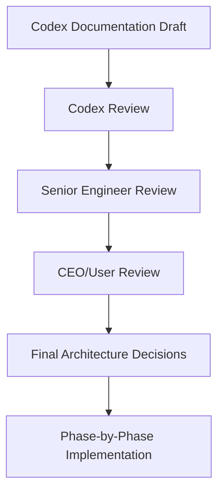

# MSI LMS Portal Documentation

This directory contains the planning and architecture documentation for MSI LMS Portal.

Status: documentation package for CEO review, senior engineer review, and final architecture agreement.

## Project Context

- Project name: MSI LMS Portal.
- Production branch: `main`.
- Planning/rewrite branch: `FastAPI-Run-System`.
- Backend: FastAPI.
- Frontend: React/Vite.
- Telegram bot: aiogram.
- Database: PostgreSQL schema `msi_v2`.
- Excel and Google Sheets are import/export sources only.
- Current schools: School 5 and Sehriyo.
- More schools will be added later.

## Reading Order

### CEO Package

Start here for business and leadership review:

1. [CEO Overview](./CEO_OVERVIEW.md)
2. [CEO Product Vision](./CEO_PRODUCT_VISION.md)
3. [CEO Roadmap](./CEO_ROADMAP.md)
4. [CEO Risks And Decisions](./CEO_RISKS_AND_DECISIONS.md)

### Engineering Package

Start here for senior engineer review:

1. [Engineering Overview](./ENGINEERING_OVERVIEW.md)
2. [Engineering Architecture](./ENGINEERING_ARCHITECTURE.md)
3. [Engineering Module Map](./ENGINEERING_MODULE_MAP.md)
4. [Engineering Database](./ENGINEERING_DATABASE.md)
5. [Engineering Auth And Roles](./ENGINEERING_AUTH_AND_ROLES.md)
6. [Engineering Route Map](./ENGINEERING_ROUTE_MAP.md)
7. [Engineering Telegram Flow](./ENGINEERING_TELEGRAM_FLOW.md)
8. [Engineering Payment Access Policy](./ENGINEERING_PAYMENT_ACCESS_POLICY.md)
9. [Engineering Migration Plan](./ENGINEERING_MIGRATION_PLAN.md)
10. [Engineering Deployment](./ENGINEERING_DEPLOYMENT.md)
11. [Engineering Testing](./ENGINEERING_TESTING.md)
12. [Engineering Technical Debt](./ENGINEERING_TECHNICAL_DEBT.md)

### Existing Architecture Notes

These planning files contain earlier detailed architecture notes:

- [MSI LMS Architecture](./MSI_LMS_ARCHITECTURE.md)
- [MSI LMS Modules](./MSI_LMS_MODULES.md)
- [MSI LMS Target Schema](./MSI_LMS_TARGET_SCHEMA.md)
- [MSI LMS Auth And Roles](./MSI_LMS_AUTH_AND_ROLES.md)
- [MSI LMS Migration Plan](./MSI_LMS_MIGRATION_PLAN.md)
- [MSI LMS Payment Access Policy](./MSI_LMS_PAYMENT_ACCESS_POLICY.md)
- [MSI LMS Telegram Parent Linking](./MSI_LMS_TELEGRAM_PARENT_LINKING.md)

## Review Workflow

## Documentation Rules

- CEO documents are business-friendly and non-technical.
- Engineering documents are technical and implementation-oriented.
- Current implementation and target architecture are labeled separately.
- Future modules are clearly marked as future.
- No secrets, tokens, database URLs, private student data, parent phone numbers, Telegram IDs, raw grades, or row-level private data should appear in these docs.

## Confirmed Decisions

- PostgreSQL is the source of truth.
- One user has exactly one role.
- `system_admin` is an internal operator, not an LMS business role.
- Real LMS roles are `ceo`, `hr_manager`, `customer_support`, `student`, `teacher`, `parent`, and `academic_director`.
- Teacher login format is `TCH0001`.
- Student login is MSI code plus password.
- Parents are Telegram-first in the first rebuild.
- Customer Support is B2C support.
- B2B unpaid school contracts escalate to CEO only.
- Academic Director has full academic access.
- CEO has broad company visibility.
- AI, Google Slides, and adaptive learning are future modules.

## Open Decisions

- Which CEO drilldowns require audit events in v1?

## Recently Confirmed Decisions

- Account model is approved: one shared account record for every login user, with separate role-specific profiles.
- Parent invite links can be generated by CEO, Academic Director, and Customer Support.
- Customer Support can request B2C access restrictions from CEO or Academic Director.
- After approval, Customer Support can continue the B2C payment/support workflow.
- B2C payment restriction uses two warnings: incoming payment warning, then final few-days warning, then restriction until payment is completed.
